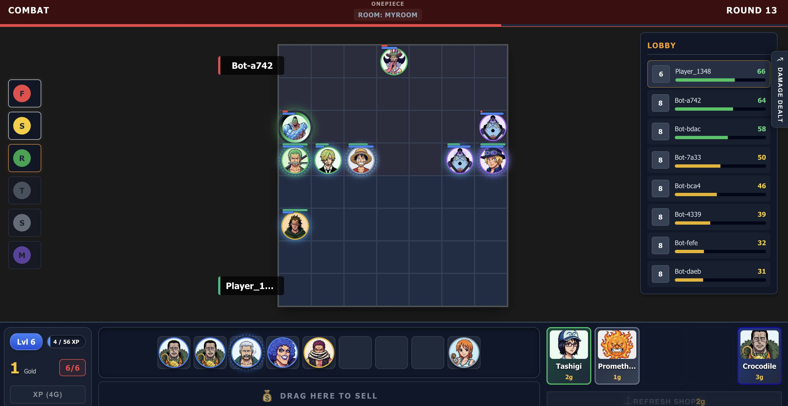

# One Piece Tactics

A browser-based **auto-battler game** inspired by Teamfight Tactics, featuring a theme-swappable engine with lobby-selectable One Piece (default) and Pokemon modes. This project showcases a clean, production-grade architecture with real-time multiplayer via WebSockets.

   



---

## 📖 Documentation

For detailed architectural information, refer to the context documents:

| Document | Description |
|----------|-------------|
| **[Backend Context](backend/BACKEND_CONTEXT.md)** | Game engine, combat system, WebSocket API, state management |
| **[Frontend Context](frontend/FRONTEND_CONTEXT.md)** | Vue.js architecture, component hierarchy, animation system |
| **[Deployment Guide](deployment/DEPLOYMENT_GUIDE.md)** | Docker Compose setup, GitOps deployment to production |

---

## ✨ Features

### Core Gameplay
- **Up to 8 players** per game room (human + AI bots with adaptive shop odds)
- **Real-time state sync** via STOMP WebSockets (100ms tick rate)
- **Theme-agnostic core engine** — hosts choose One Piece or Pokemon per room in the lobby; config controls the default
- **Auto-battler mechanics**: Shop, XP, Gold (with interest), Trait Synergies, Unit Combinations
- **Grid-based combat** with BFS pathfinding, ability casting, and directional attack animations
- **Star-level progression** — combine 3 matching 1★ units into 1 2★, then 2 matching 2★ units into 1 3★, including Pokemon evolution forms
- **Round-based augment choices** — players choose team-wide economy or combat bonuses on rounds 2, 5, and 10
- **Advanced ability system** — Damage, Stun, Shield, Heal, Buff with modifiers (Lifesteal, Execute, Scaling, Conditional, Knockback)
- **Data-driven trait system** — All trait effects loaded from JSON configuration (no hardcoded logic)
- **TFT-style shop odds** — Level-based probability distribution for unit costs (1★-5★)
- **In-memory game state** — no database required

### Combat & Progression
- **Ghost/clone matchmaking** — Odd player count creates AI clones for balanced combat
- **Player elimination** — Ranked placement system with game-ending logic
- **Loot orbs** — Gold and unit rewards spawn after combat rounds
- **Pokemon type effectiveness** — Pokemon auto attacks and damage abilities apply type matchup modifiers
- **Tabbed damage report** — Post-combat tracking for your units vs opponent with visual damage bars
- **Per-unit attack animations** — Punch, slash, projectile with directional orientation
- **Ability patterns** — Single-target, line, and AoE effects with range-based targeting

### UI/UX Enhancements
- **Cost-based visual styling** — Dynamic borders and glows based on unit rarity (1★ gray → 5★ gold)
- **Star-level visual effects** — Enhanced borders and top glows for 2★ and 3★ units
- **Shop probability tooltip** — Hover over player level to see current unit cost distribution
- **Git-based version display** — Build metadata (tag, commit, timestamp) in bottom-left corner
- **Smart unit tooltips** — HTML-formatted ability descriptions with star-level value highlighting
- **Player board spectating** — Click alive players in the right panel to view their board and combat from their perspective
- **Keyboard shortcuts** — Enter key support for room creation/joining
- **Bench reordering** — Swap and rearrange units even during combat phase
- **Team-colored health bars** — Emerald for allies, red for opponents

---

## 🏗️ Architecture

```
┌─────────────────────────────────────────────────────────────────────┐
│                        BACKEND (Java 25 + Spring Boot 4)            │
│  ┌────────────┐  ┌────────────┐  ┌────────────┐  ┌────────────────┐ │
│  │ GameEngine │──│  GameRoom  │──│   Player   │──│   GameUnit     │ │
│  └────────────┘  └────────────┘  └────────────┘  └────────────────┘ │
│        │                │                                           │
│  ┌─────┴──────┐  ┌──────┴───────┐  ┌──────────────────────────────┐ │
│  │ DataLoader │  │ CombatSystem │  │ TraitManager                 │ │
│  └────────────┘  └──────────────┘  └──────────────────────────────┘ │
└──────────────────────────┬──────────────────────────────────────────┘
                           │ WebSocket (STOMP)
                           ▼
┌─────────────────────────────────────────────────────────────────────┐
│                      FRONTEND (Vue 3 + TypeScript)                  │
│  ┌───────────┐  ┌───────────────┐  ┌────────────┐  ┌──────────────┐ │
│  │  App.vue  │──│ GameInterface │──│ GameCanvas │──│ Animations   │ │
│  └───────────┘  └───────────────┘  └────────────┘  └──────────────┘ │
└─────────────────────────────────────────────────────────────────────┘
```

**Key Design Principles:**
- **Backend Authority** — All game logic runs on the server; frontend is a rendering layer
- **Theme-Agnostic Core** — `GameUnit`, `Trait`, `Origin` are generic; themes are loaded via `GameModeProvider`
- **Testability** — Time and randomness are abstracted (`Clock`, `RandomProvider`) for deterministic testing
- **Strategy Pattern** — Combat behaviors (`TargetSelector`, `UnitMover`, `AbilityCaster`) are injectable

---

## 🛠️ Tech Stack

### Backend
| Technology | Version | Purpose |
|------------|---------|---------|
| Java | 25 (Preview) | Core language |
| Spring Boot | 4.1.0 | Application framework |
| WebSocket (STOMP) | — | Real-time communication |
| Maven | — | Build tool |
| Lombok | — | Boilerplate reduction |
| Jackson | — | JSON serialization |

### Frontend
| Technology | Version | Purpose |
|------------|---------|---------|
| Vue.js | 3.5 | UI framework |
| TypeScript | 5.9 | Type-safe JavaScript |
| Vite | 8.1 | Build tool & dev server |
| @stomp/stompjs | 7.3 | WebSocket client |
| Vanilla CSS | — | Scoped component styling |

### Infrastructure
| Technology | Purpose |
|------------|---------|
| Docker & Docker Compose | Containerization |
| Nginx | Reverse proxy |

---

## 🚀 Quick Start

### Prerequisites
- Java 25
- Node.js 20.19+ or 22.12+ & npm
- Docker (optional, for containerized deployment)

### Run Backend
```bash
cd backend

# Default lobby mode: One Piece
mvn spring-boot:run

# Or make Pokemon the default lobby mode
GAME_MODE=pokemon mvn spring-boot:run
```
Backend runs on `http://localhost:8080`

### Run Frontend
```bash
cd frontend
npm install
npm run dev
```
Frontend runs on `http://localhost:5173` with WebSocket proxy to backend

### Run with Docker
```bash
docker-compose up
```

---

## 🎮 Game Modes

Rooms start with the configured default mode, then the host can switch modes in the lobby before starting the match. Changing the room mode swaps the unit set, traits, visuals, and mode-specific combat rules for that room.

| Mode | Property Value | Data Files |
|------|----------------|------------|
| One Piece | `game.mode=onepiece` | `units_onepiece.json`, `traits_onepiece.json`, `augments_onepiece.json` |
| Pokemon | `game.mode=pokemon` | `units_pokemon.json`, `traits_pokemon.json`, `augments_pokemon.json` |

Use `GAME_MODE` or `game.mode` to choose the default lobby selection. To add a new theme, implement `GameModeProvider` and add corresponding JSON data files. See [Backend Context](backend/BACKEND_CONTEXT.md#8-game-mode-system) for details.

---

## 📡 API Reference

### WebSocket Endpoints
| Destination | Direction | Description |
|-------------|-----------|-------------|
| `/app/create` | Client → Server | Create a new game room |
| `/app/join` | Client → Server | Join an existing room |
| `/app/start` | Client → Server | Host starts the match |
| `/app/room/{id}/mode` | Client → Server | Host changes the room game mode during lobby |
| `/app/room/{id}/action` | Client → Server | Player action (BUY, MOVE, REROLL, EXP, SELL, LOCK, COLLECT_ORB, READY_FOR_COMBAT, SELECT_AUGMENT) |
| `/topic/room/{id}` | Server → Client | Game state broadcast (100ms) |
| `/topic/room/{id}/event` | Server → Client | Combat result events (winner, loser, damageLog) |

Client actions are bound to the STOMP session that joined the room. The backend rejects actions, start requests, and mode changes that attempt to act as a different player id.
Augment choices are included in each player's `GameState` snapshot as `augmentChoices`; selected augments are exposed as `selectedAugments`.

### REST Endpoints
| Endpoint | Method | Description |
|----------|--------|-------------|
| `/api/config` | GET | Default game mode and available lobby modes |
| `/api/mode` | GET | Default game mode |
| `/api/traits?mode={mode}` | GET | Trait definitions for the selected mode |

---

## 🧪 Development

### Code Formatting
```bash
# Backend: Run Spotless formatter
cd backend && mvn spotless:apply
```

### Balance Simulation Reports
```bash
cd backend

# Existing same-star board simulation
mvn -Dtest=BalanceSimulationReportTest -Dsimulation.report=true -Dsimulation.runs=100000 -Dsimulation.threads=8 test

# Keep the same board-building rules, but randomize every unit's star level
mvn -Dtest=BalanceSimulationReportTest -Dsimulation.report=true -Dsimulation.runs=100000 -Dsimulation.threads=8 -Dsimulation.style=random-stars test

# Randomize board sizes, units, star levels, and positions
mvn -Dtest=BalanceSimulationReportTest -Dsimulation.report=true -Dsimulation.runs=100000 -Dsimulation.threads=8 -Dsimulation.style=random-boards test
```

Reports are written to `backend/target/simulation-reports`. Every style also writes unit and trait rankings for board
sizes 2–7.

### Build for Production
```bash
# Backend
cd backend && mvn package

# Frontend
cd frontend && npm run build
```

---

## 📄 License

This project is for educational purposes.

---

*Last updated: 2026-06-30*
