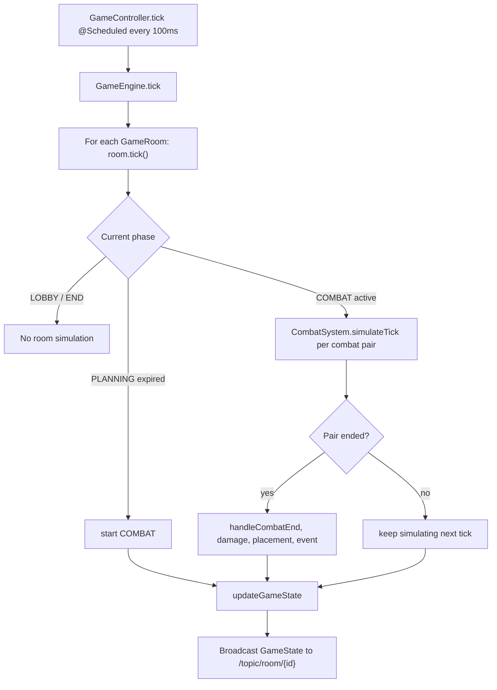

# Backend Context - One Piece Tactics

## 1. System Overview

**Role**: Stateful, real-time game server for a TFT-style auto-battler.

The backend is the authoritative source for match state. It owns:
- In-memory multiplayer game rooms.
- A scheduled round loop: `LOBBY -> PLANNING -> COMBAT -> END_CELEBRATION -> END`.
- Auto-battle simulation, movement, damage, mana, abilities, traits, augments, loot, bots, and elimination.
- Real-time synchronization to the frontend through STOMP WebSocket topics.
- A theme-agnostic engine with pluggable game modes: `onepiece` and `pokemon`.

Live match state is not database-backed. `GameEngine` keeps active rooms in memory until a match reaches `END`, then
removes the room on the next tick. The separate analytics subsystem writes anonymous match, player-run,
and per-round snapshots to SQLite; it never restores or controls authoritative match state.

Architecturally this is not a classic CRUD layered backend. It is a custom stateful game-loop architecture with Spring used for bootstrapping, REST config endpoints, scheduling, and WebSocket transport.

---

## 2. Tech Stack & Standards

| Component | Version/Tool | Notes |
|-----------|--------------|-------|
| Java | 25 | Configured in `pom.xml`; preview flags are not enabled. |
| Spring Boot | 4.1.0 | Web, WebSocket, scheduling. |
| Build Tool | Maven | Backend `pom.xml` is in `/backend`. |
| WebSockets | STOMP over native WebSocket | Endpoint `/tft-websocket`; no SockJS fallback is configured. |
| JSON | Jackson 3 runtime APIs plus Jackson annotations | `tools.jackson.databind.json.JsonMapper` is used by loaders. |
| Code Style | Spotless + Palantir Java Format | `mvn spotless:apply`. |
| DI Pattern | Constructor injection | Mostly Lombok `@RequiredArgsConstructor`; engine domain classes are manually constructed. |

### Java 25 Features in Use

- Records are heavily used for DTOs and immutable data: `GameState`, `GameAction`, `UnitDefinition`, `AbilityDefinition`, modifiers, combat results.
- `var` is used for local variables.
- Switch expressions appear in level and modifier logic.
- `AbilityModifier` is a sealed interface.
- Streams are used for collection mapping/filtering.
- No virtual threads, structured concurrency, or async command queue are currently used.

---

## 3. Architecture Map

```
src/main/java/net/lwenstrom/tft/backend/
├── BackendApplication.java              # Spring Boot entry point; enables scheduling.
├── api/
│   └── InfoController.java              # REST config endpoint: /api/config.
├── config/
│   └── WebSocketConfig.java             # STOMP broker and /tft-websocket endpoint.
├── core/
│   ├── DataLoader.java                  # Lazy/eager mode data cache for units and traits.
│   ├── GameController.java              # REST traits/mode endpoints, WebSocket handlers, scheduled tick broadcaster.
│   ├── GameModeProvider.java            # Provider contract for mode-specific resources and trait registration.
│   ├── GameModeRegistry.java            # Provider map plus default mode from spring property game.mode.
│   ├── GameConstants.java               # Tick, economy, board, bot, combat, and loot constants.
│   ├── combat/
│   │   ├── AbilityCaster.java           # Ability casting strategy interface.
│   │   ├── DefaultAbilityCaster.java    # Damage/heal/buff/shield/stun ability implementation and modifiers.
│   │   ├── TargetSelector.java          # Target selection interface.
│   │   ├── NearestEnemyTargetSelector.java
│   │   ├── UnitMover.java               # Movement strategy interface.
│   │   ├── BfsUnitMover.java            # BFS pathing on the combat grid.
│   │   ├── CombatUtils.java             # Ally/enemy and distance helpers.
│   │   └── PokemonTypeEffectiveness.java # Pokemon type damage modifier.
│   ├── engine/
│   │   ├── GameEngine.java              # In-memory room registry and room tick orchestration.
│   │   ├── GameRoom.java                # One match instance: phase state, players, matchups, combat pairs, room mode.
│   │   ├── Player.java                  # Player economy, bench, board, shop, XP, loot, upgrades.
│   │   ├── CombatSystem.java            # Combat tick simulation, damage log, combat events.
│   │   ├── AugmentManager.java          # Round-based augment offers, selection rewards, and combat effects.
│   │   ├── TraitManager.java            # Counts unique unit lines and applies registered trait effects.
│   │   ├── GenericTraitApplier.java     # Data-driven trait effect implementation.
│   │   ├── UnitDefinition.java          # JSON unit blueprint with role, DEF, and optional star-level forms.
│   │   ├── UnitFormDefinition.java      # Star form override for id/name/role/traits/range/ability.
│   │   ├── StandardGameUnit.java        # Runtime unit built from a UnitDefinition/star level.
│   │   ├── AbstractGameUnit.java        # Mutable runtime stats, positions, buffs, shields, dots, trait fields.
│   │   ├── Bench.java                   # Fixed 9-slot bench abstraction.
│   │   ├── Grid.java                    # Board occupancy and placement rules.
│   │   └── ShopOdds.java                # Level-based cost-tier probabilities.
│   ├── model/
│   │   ├── GameState.java               # Full snapshot sent to /topic/room/{roomId}.
│   │   ├── GameAction.java              # Client action payload.
│   │   ├── GameMode.java                # JSON values: onepiece, pokemon.
│   │   ├── GamePhase.java               # LOBBY, PLANNING, COMBAT, END_CELEBRATION, END.
│   │   ├── ActionType.java              # BUY, SELL, MOVE, REROLL, EXP, LOCK, COLLECT_ORB, READY_FOR_COMBAT, SELECT_AUGMENT.
│   │   ├── AugmentDefinition.java       # Data-loaded augment blueprint.
│   │   ├── AugmentOffer.java            # Per-player augment choice DTO.
│   │   ├── SelectedAugment.java         # Persisted selected augment DTO.
│   │   ├── AbilityDefinition.java       # Ability metadata and star-level values/ranges.
│   │   ├── AbilityModifier.java         # Sealed modifier hierarchy.
│   │   ├── EffectType.java              # Generic trait effect enum.
│   │   ├── TraitMetadata.java           # REST/frontend trait metadata.
│   │   └── LootOrb.java, DotEffect.java, GameItem.java, etc.
│   ├── random/
│   │   ├── RandomProvider.java          # Testable RNG abstraction.
│   │   └── DefaultRandomProvider.java
│   └── time/
│       ├── Clock.java                   # Testable clock abstraction.
│       └── SystemClock.java
└── game/
    ├── onepiece/
    │   ├── OnePieceGameModeProvider.java # One Piece units/traits provider.
    │   └── OnePieceTraitLoader.java      # Registers generic trait appliers from traits_onepiece.json.
    └── pokemon/
        ├── PokemonGameModeProvider.java  # Pokemon units/traits provider.
        └── PokemonTraitLoader.java       # Registers generic trait appliers from traits_pokemon.json.

src/main/resources/data/
├── units_onepiece.json                  # 55 One Piece units.
├── traits_onepiece.json                 # 18 One Piece traits.
├── augments_onepiece.json               # 15 One Piece augment definitions.
├── units_pokemon.json                   # 55 Pokemon unit lines with evolution forms.
├── traits_pokemon.json                  # 16 Pokemon type traits.
└── augments_pokemon.json                # 15 Pokemon augment definitions.
```

---

## 4. The Game Loop Explained

### High-Level Flow



### Threading and State

- `GameController.tick()` is scheduled with `fixedRate = GameConstants.TICK_RATE_MS` (`100ms`).
- The tick calls `GameEngine.tick()`, then broadcasts every active room state.
- WebSocket handlers mutate `GameRoom`/`Player` immediately on the message-handling thread.
- There is no actor mailbox or queued command buffer. `rooms`, `players`, and some maps are concurrent collections, but `Player`, `Bench`, `Grid`, and units are mutable and not fully synchronized.
- The practical model is "authoritative in-memory game state with scheduled simulation", not event sourcing and not a database-backed service.

### Phase Lifecycle

1. `LOBBY`
   - Players join.
   - First player becomes host.
   - Host can change room mode while still in `LOBBY`.
   - Host starts match.
2. `PLANNING`
   - `round` increments.
   - Combat state is restored via `CombatSystem.endCombat`.
   - Players leave combat mode, pending upgrades are processed, income/XP/shop/loot/bot roster updates run.
   - Augment offers are generated on rounds `3`, `6`, and `11` for alive players.
   - Bots select an offered augment immediately; human choices remain in `PlayerState.augmentChoices`.
   - Duration is `BASE_PLANNING_DURATION_MS + (round - 1) * PLANNING_DURATION_INCREMENT_MS`.
3. `COMBAT`
   - Any unselected human augment choices are randomly selected before combat setup.
   - Unclaimed loot orbs are collected for alive players before units enter combat.
   - Alive players are shuffled and paired.
   - Odd player count creates a ghost clone from another alive player.
   - Players are marked in combat and `autoFillBoard()` fills empty board capacity from bench.
   - `CombatSystem.startCombat()` applies traits and mirrors board positions into the 9x6 combat grid.
   - `AugmentManager.applyCombatEffects()` applies selected augment combat effects after combat positions/traits are initialized.
   - Each 100ms tick processes dots, stuns, abilities, attacks, mana gain, movement, death, shields, and damage logs.
   - Max combat duration is `COMBAT_PHASE_MS` (`32000ms`) in every round.
4. `END_CELEBRATION`
   - Starts when one or zero alive players remain.
   - Last survivor gets `place = 1`.
   - Lasts `6000ms`.
5. `END`
   - `GameEngine.tick()` removes the room from the in-memory map.

---

## 5. Game Modes, Room Modes, and Data

### Global Default vs Per-Room Mode

`GameModeRegistry` builds a provider map from Spring beans and reads the default from `game.mode`, defaulting to `onepiece`.

`GameEngine.createRoom()` creates each new `GameRoom` with that default mode. After creation, mode is stored on the room itself:

```java
private GameMode gameMode;
```

The mode is therefore per room, not only global. The global/default mode only decides the initial room mode and REST default responses.

### Changing Room Mode

The host can change room mode through:

```
/app/room/{id}/mode
```

Payload:

```json
{
  "playerName": "Host name",
  "gameMode": "pokemon"
}
```

Rules:
- The room must exist.
- The sender is resolved from the STOMP session that joined the room.
- Only the session-bound host can change mode.
- `GameRoom.setGameMode()` only succeeds in `LOBBY`.
- Changing to the current mode or passing `null` is ignored.

Mode-change reset behavior:
- Room `gameMode` is changed.
- `TraitManager` effects are cleared and re-registered for the new mode.
- Every existing `Player` runs `resetForMode(newMode)`.
- Player reset clears shop lock, board lock, combat flag, pending upgrades, loot orbs, augment choices, selected augments, bench, and board units, then rolls a free shop for the new mode.
- Player id, name, host status, health, gold, level, and XP are not reset by `resetForMode`.

### Data Loading

`DataLoader` caches data by mode:

```java
private final Map<GameMode, ModeData> modeDataCache = new ConcurrentHashMap<>();
```

- `@PostConstruct` preloads only the default mode.
- Other modes are lazy-loaded on first use with `computeIfAbsent`.
- `ModeData` contains a unit registry, trait metadata list, and augment definitions.
- `getAllUnits(mode)`, `getUnitDefinition(mode, id)`, `findUnitDefinition(mode, idOrLineIdOrName)`, `getTraitMetadata(mode)`, and `getAugments(mode)` always resolve through the mode cache.
- Each mode provider supplies units, traits, and augments resource paths. The default augment path convention is `/data/augments_{mode}.json`, with explicit paths in the One Piece and Pokemon providers.

### Unit Definitions and Forms

`UnitDefinition` is the content source for shop units and runtime unit construction. Star-level stat lists are read directly:

- `maxHealth`
- `maxMana`
- `attackDamage`
- `abilityPower`
- `defense`
- `attackSpeed`
- `range`

Every definition also has a theme-agnostic `UnitRole`: `DAMAGE`, `TANK`, or `SUPPORT`.

Optional form overrides are represented by `UnitFormDefinition`:

```java
public record UnitFormDefinition(
    int starLevel,
    String definitionId,
    String name,
    UnitRole role,
    List<String> traits,
    List<Integer> range,
    AbilityDefinition ability
) {}
```

When `new StandardGameUnit(def, starLevel)` is built, it uses:
- `def.getDefinitionId(starLevel)`
- `def.getName(starLevel)`
- `def.getRole(starLevel)`
- `def.getTraits(starLevel)`
- `def.getAbility(starLevel)`
- `def.getActiveRange(starLevel)`
- Star-level stats from the stat lists.

This is how Pokemon evolutions work. Three `Charmander` copies still combine by `lineId = "charmander"`, but the resulting 2-star runtime unit can become `definitionId = "charmeleon"` and `name = "Charmeleon"`. A form can also change role; Caterpie resolves as Support at 1★, Tank at 2★, and Support at 3★.

---

## 6. API & Event Intermediary

### REST Endpoints

| Endpoint | Method | Response | Purpose |
|----------|--------|----------|---------|
| `/api/config` | GET | `{"defaultGameMode":"onepiece","availableModes":["onepiece","pokemon"]}` | Frontend config for default and selectable modes. |
| `/api/traits?mode=onepiece` | GET | `TraitMetadata[]` | Trait metadata for requested mode; missing/unknown mode falls back through `GameMode.fromString` to `onepiece`. |
| `/api/mode` | GET | `"onepiece"` or `"pokemon"` | Current global default mode, not a room's mode. |
| `/api/admin/auth/login` | POST | Bearer token and expiry | Exchanges the configured analytics password for an eight-hour admin session. |
| `/api/admin/auth/logout` | POST | Empty response | Revokes the current admin bearer token. |
| `/api/admin/analytics/summary` | GET | Aggregate analytics | Protected match, run, abandonment, placement, mode, and outcome totals. |
| `/api/admin/analytics/runs` | GET | Cursor-paginated runs | Protected anonymous player runs with date, mode, client, and abandonment filters. |
| `/api/admin/analytics/runs/{runId}` | GET | Run and round snapshots | Protected round-by-round board and progression detail. |

`/api/config` lives in `api/InfoController`. `/api/traits` and `/api/mode` live in `core/GameController`.

### WebSocket Configuration

- Endpoint: `/tft-websocket`
- STOMP application prefix: `/app`
- Broker prefix: `/topic`
- Allowed origins: `*`
- SockJS is not enabled in `WebSocketConfig`.

### Client -> Server Messages

| STOMP destination | Payload | Behavior |
|-------------------|---------|----------|
| `/app/create` | `RoomRequest` | Creates a room, adds the creator with anonymous analytics/reconnect identity, and binds the STOMP session. |
| `/app/join` | `RoomRequest` | Adds a lobby player or rebinds an active player presenting the matching reconnect token. |
| `/app/leave` | `RoomRequest` | Removes lobby players; active players remain simulated and enter the disconnect grace period. |
| `/app/start` | `RoomRequest` | Resolves player from the STOMP session and starts only if that player is host. Adds bots up to 8 players. |
| `/app/room/{id}/add-bot` | no body required | Adds one bot to the room. |
| `/app/room/{id}/mode` | `ModeChangeRequest` | Session-bound host-only LOBBY mode change; resets player mode data as described above. |
| `/app/room/{id}/action` | `GameAction` | Rejects mismatched `playerId`, runs one session-bound player action immediately, then broadcasts state. |

Action/start/mode authority is session-bound. `GameAction.playerId` must match the player id recorded for the sender's STOMP session during `/app/create` or `/app/join`; otherwise the action is ignored.

`RoomRequest`:

```json
{
  "roomId": "room-123",
  "playerName": "Alice",
  "analyticsClientId": "anonymous-browser-uuid",
  "reconnectToken": "secret-per-tab-room-token"
}
```

The reconnect token is hashed server-side and never appears in shared `GameState`. WebSocket disconnects and explicit
active-game leaves start a 60-second grace period. After that the player run is marked abandoned, but its board keeps
participating and remains eligible for round snapshots and final placement.

`ModeChangeRequest`:

```json
{
  "playerName": "Alice",
  "gameMode": "pokemon"
}
```

`GameAction`:

```json
{
  "type": "BUY | SELL | MOVE | REROLL | EXP | LOCK | COLLECT_ORB | READY_FOR_COMBAT | SELECT_AUGMENT",
  "playerId": "player-uuid",
  "unitId": "unit-uuid",
  "orbId": "orb-uuid",
  "targetX": 0,
  "targetY": 0,
  "shopIndex": 0,
  "augmentId": "augment-id"
}
```

Action-specific fields:
- `BUY`: `playerId`, `shopIndex`
- `SELL`: `playerId`, `unitId`
- `MOVE`: `playerId`, `unitId`, `targetX`, `targetY`
- `REROLL`: `playerId`
- `EXP`: `playerId`
- `LOCK`: `playerId`
- `COLLECT_ORB`: `playerId`, `orbId`
- `READY_FOR_COMBAT`: `playerId`
- `SELECT_AUGMENT`: `playerId`, `augmentId`

Move conventions:
- Bench to board: `targetY >= 0`, `targetX/targetY` are board coordinates.
- Board to bench: `targetY < 0`, `targetX` is target bench slot.
- Bench to bench: `targetY < 0`, `targetX` is target bench slot.

### Server -> Client Topics

| Topic | Payload | Frequency |
|-------|---------|-----------|
| `/topic/room/{roomId}` | `GameState` | Every scheduled tick for every active room, and immediately after handled messages. |
| `/topic/room/{roomId}/event` | `RoomEvent<T>` | Typed `COMBAT_RESULT` and `EMERGENCY_DROP` events. |

`GameState`:

```java
record GameState(
    String roomId,
    String hostId,
    GamePhase phase,
    long round,
    long timeRemainingMs,
    long totalPhaseDuration,
    Map<String, PlayerState> players,
    Map<String, String> matchups,
    List<CombatEvent> recentEvents,
    Map<String, CombatSystem.DamageEntry> damageLog,
    GameMode gameMode,
    boolean planningTimerPaused,
    String planningReadyPlayerId,
    PlanningPauseReason planningPauseReason
)
```

`PlayerState`:

```java
record PlayerState(
    String playerId,
    String name,
    int health,
    int gold,
    int level,
    int xp,
    int nextLevelXp,
    Integer place,
    String combatSide,
    List<GameUnit> bench,
    List<GameUnit> board,
    List<Trait> activeTraits,
    List<UnitDefinition> shop,
    List<LootOrb> lootOrbs,
    List<AugmentOffer> augmentChoices,
    List<SelectedAugment> selectedAugments,
    boolean isGhost
)
```

Important frontend alignment note: `activeTraits` is currently emitted as an empty list in `Player.toState()`. Trait effects still apply in combat through `TraitManager`, but the live state snapshot does not yet calculate/display active traits for the UI.

`planningTimerPaused` is currently used for solo-human training rooms with bots. `planningPauseReason` is `SOLO_READY` in that case and `null` otherwise; augment choices do not pause the timer. Pending augment choices are auto-selected when combat starts.

`AugmentOffer` is the temporary choice object sent during augment rounds:

```java
record AugmentOffer(
    String id,
    String name,
    String description,
    AugmentTier tier,
    AugmentEffectType effectType,
    int value,
    String image
)
```

`SelectedAugment` has the same selected effect data plus `selectedRound`.

`CombatEvent`:

```java
record CombatEvent(
    long timestamp,
    String type,
    String sourceId,
    String targetId,
    int value,
    String skillName
)
```

Known event types emitted by combat code include `DAMAGE`, `SKILL`, `DEATH`, `HEAL`, and `SHIELD`.

`COMBAT_RESULT` event payload:

```json
{
  "type": "COMBAT_RESULT",
  "payload": {
    "winnerId": "player-uuid-or-empty-string",
    "loserId": "player-uuid-or-empty-string",
    "participantIds": ["player-1", "player-2"],
    "damageLog": {
      "unit-runtime-id": {
        "name": "Luffy",
        "damage": 1234
      }
    }
  }
}
```

`EMERGENCY_DROP` is published when the pending drop spawns at the next planning phase. Its `round` is that new planning
round:

```json
{
  "type": "EMERGENCY_DROP",
  "payload": {
    "dropId": "drop-uuid",
    "playerId": "player-uuid",
    "round": 7,
    "orbIds": ["orb-uuid-1", "orb-uuid-2"]
  }
}
```

Live `GameState.damageLog` uses the full `CombatSystem.DamageEntry` record:

```java
record DamageEntry(String unitName, String definitionId, String ownerId, int damage)
```

---

## 7. State Management Deep Dive

### Where GameState Is Held

State is per room. `GameEngine` owns:

```java
private final Map<String, GameRoom> rooms = new ConcurrentHashMap<>();
```

Each `GameRoom` owns mutable runtime state:

```java
private String hostId;
private GameState currentState;
private final Map<String, Player> players = new ConcurrentHashMap<>();
private final Map<String, String> currentMatchups = new ConcurrentHashMap<>();
private final List<List<Player>> activeCombats = new ArrayList<>();
private GamePhase phase = GamePhase.LOBBY;
private int round = 0;
private GameMode gameMode;
private final TraitManager traitManager;
private final CombatSystem combatSystem;
private AugmentManager augmentManager;
```

`GameState` is an immutable record snapshot rebuilt by `GameRoom.updateGameState()`. The frontend never mutates state directly. It sends commands through WebSocket; backend mutates room/player objects; state snapshots are broadcast back.

### Player, GameUnit, and GameRoom Interaction

- `GameRoom` controls phase transitions, matchmaking, combat pairs, mode, augment rounds, loot spawning, bots, and game end.
- `Player` controls economy, XP, shop, bench slots, board units, selling, moving, upgrades, auto-fill, loot collection, and selected augment state.
- `GameUnit` is an interface implemented by `AbstractGameUnit`/`StandardGameUnit`. Runtime units are mutable combat objects with ids, owner ids, positions, star levels, stats, mana, buffs, dots, shields, traits, and ability references.
- `UnitDefinition` is data. `StandardGameUnit` is runtime state built from that data.

---

## 8. Combat System Architecture

### Combat Initialization

`GameRoom.startPhase(COMBAT)`:
- Marks alive players `inCombat = true`.
- Calls `Player.autoFillBoard()`.
- Clears current matchups and active combats.
- Shuffles alive players.
- Pairs players two by two.
- Creates a ghost clone for odd player counts.
- Calls `combatSystem.startCombat(pair)` for each pair.

`CombatSystem.startCombat()`:
- Clears damage and recent events.
- Saves every unit's planning position.
- Applies traits to each player's board units.
- Assigns combat sides: lexicographically sorted first player is `TOP`, second is `BOTTOM`.
- Mirrors `TOP` rows with `(PLAYER_ROWS - 1) - y`.
- Offsets `BOTTOM` rows by `PLAYER_ROWS + y`.

### Combat Tick Simulation

`CombatSystem.simulateTick(participants)` does the following every 100ms:

1. Builds a list of all board units in the combat.
2. Applies active DOT ticks and death checks.
3. Skips dead units.
4. Updates temporary buffs on `AbstractGameUnit`.
5. Decrements stuns and skips stunned units.
6. Skips units whose attack cooldown has not elapsed.
7. If mana is full, casts ability, resets mana, and applies a 1000ms ability cooldown.
8. Otherwise finds nearest target.
9. If target is in range, calculates auto-attack damage, applies trait multipliers and Pokemon type effectiveness, applies damage, on-hit dots, death/revive/shield checks, lifesteal, mana gain, and attack cooldown.
10. If target is out of range, delegates movement to `BfsUnitMover`.
11. Ends the pair if one or fewer participants still have living board units.

### Combat End

`GameRoom.handleCombatEnd()`:
- Determines winner from `CombatResult`, or by total remaining board HP on timeout.
- Draws cause no loser damage.
- Loser damage is `BASE_COMBAT_DAMAGE + winner.boardUnits.size() + (round / 3)`.
- Ghost losers take no damage.
- Real losers at 0 health get a final `place`.
- A surviving human crossing from above 20 health to 20 or lower queues a one-time emergency drop for the next planning phase; bots, ghosts, and lethal hits are excluded.
- If one player remains, starts `END_CELEBRATION`.
- Emits typed room events through the listener configured by `GameController`.

---

## 9. Shop, Economy, Bench, Augments, and Upgrades

### Shop Odds

`ShopOdds` rolls a cost tier by player level, then picks a unit of that tier. If the tier is unavailable, it falls back to lower tiers, then any unit.

| Level | 1-Cost | 2-Cost | 3-Cost | 4-Cost | 5-Cost |
|-------|--------|--------|--------|--------|--------|
| 1 | 100% | 0% | 0% | 0% | 0% |
| 2 | 70% | 30% | 0% | 0% | 0% |
| 3 | 50% | 35% | 15% | 0% | 0% |
| 4 | 35% | 35% | 25% | 5% | 0% |
| 5 | 25% | 30% | 30% | 13% | 2% |
| 6 | 18% | 27% | 30% | 20% | 5% |
| 7 | 14% | 22% | 30% | 25% | 9% |
| 8 | 12% | 18% | 27% | 28% | 15% |
| 9 | 10% | 15% | 22% | 30% | 23% |

### Economy Notes

- Starting gold is `10`.
- XP buy costs `4` gold and grants `4` XP.
- Base income is `5`, plus interest capped at `5`.
- `Player.refreshShop()` costs `REROLL_COST` (`2`) unless shop is locked or the player has insufficient gold.
- `refreshShopFree()` exists and is used by `resetForMode`.
- Current round-start planning logic calls `p.refreshShop()`, so an unlocked round-start shop refresh also subtracts 2 gold.

### Bench and Movement Rules

Bench is a fixed 9-slot array, not just a list. `Bench.toList()` is what goes to the frontend.

Combat restrictions:
- Bench units can be sold during any phase.
- Board units can only be sold when `allowBoardSell` is true, which controller passes only during `PLANNING`.
- Bench-to-bench swaps are allowed even while in combat.
- Bench-to-board, board-to-bench, and board-to-board moves return early while `Player.inCombat` is true.

### Augments

`AugmentManager` owns offer generation, selection, instant rewards, and combat-time effects.

Offer rounds:
- Round `3`: `SILVER`
- Round `6`: `GOLD`
- Round `11`: `DIAMOND`

For each augment round, alive players receive up to 3 offers in `Player.augmentChoices`. The manager excludes already selected augment ids before shuffling candidates. Human players choose through `SELECT_AUGMENT`; bots select randomly as soon as offers are generated. If a human player still has choices when combat begins, `GameRoom.selectRandomPendingAugments()` randomly selects one before combat setup.

Instant effects are applied on selection:
- `GOLD`
- `XP`
- `GOLD_PER_EMPTY_BENCH_SLOT`

Combat effects are applied after `CombatSystem.startCombat()`:
- Team attack speed per ranged unit.
- Team damage reduction.
- Team attack damage on kill.
- Team max health, attack damage, ability power, and DEF.
- Melee lifesteal.
- Ranged attack damage.
- Team mana gain, starting mana, and starting shield.

Combat-only stat changes are reset by `AbstractGameUnit.restorePlanningPosition()` when combat ends.

### Upgrades and Evolutions

`Player.checkUpgrade(lineId, starLevel)` searches bench and board for copies with the same `lineId` and same star level.

When found:
- Three 1-star units are removed to create a 2-star unit.
- Two 2-star units are removed to create a 3-star unit.
- 3-star units do not upgrade further.
- One upgraded `StandardGameUnit(def, starLevel + 1)` is created.
- Placement is preserved from a board unit if possible; otherwise the unit goes to bench.
- The method recursively checks for chained upgrades.

Sell value follows invested copy count: 1-star units sell for `cost`, 2-star units sell for `cost * 3`, and 3-star units sell for `cost * 6`.

When a unit is bought during combat, upgrade checking is deferred:

```java
pendingUpgrades.add(new PendingUpgrade(def.lineId(), 1));
```

`processPendingUpgrades()` runs at the start of the next `PLANNING` phase.

---

## 10. Trait System

Trait logic is data-driven and mode-specific.

1. `GameRoom` creates a `TraitManager`.
2. The current room mode's provider registers trait effects into that manager.
3. `TraitManager.applyTraits(player.getBoardUnits())` runs at combat start.
4. `TraitManager` counts unique unit lines per normalized trait id, not duplicate copies.
5. If an effect exists for the trait, it applies the highest matching breakpoint.

`GenericTraitApplier` supports:

| EffectType | Effect |
|------------|--------|
| `HP` | Adds max/current HP. |
| `HP_AND_AS` | Adds HP and attack speed. |
| `AS` | Adds attack speed. |
| `DEFENSE` | Adds flat DEF. |
| `ATK_BUFF` | Multiplies attack damage buff and can mark shield-on-death. |
| `START_MANA` | Adds flat starting mana. |
| `START_MANA_PERCENT` | Adds starting mana from max mana percent. |
| `ABILITY_DAMAGE` | Multiplies ability damage. |
| `LOW_HP_DAMAGE` | Adds damage below HP threshold. |
| `LIFESTEAL` | Adds lifesteal and optional revive. |
| `EXTRA_ATTACK_CHANCE` | Chance to shorten next attack cooldown. |
| `ON_HIT_DOT` | Adds on-hit DOT fields. |
| `MANA_GAIN` | Multiplies mana gained per hit. |
| `LOW_HP_AS` | Adds attack speed below HP threshold. |
| `DISTANCE_DAMAGE` | Adds damage by distance to target. |
| `GOLD_ON_WIN` | Sets bonus gold min/max used by room planning logic. |
| `HEAL_AMP` | Multiplies healing. |
| `AS_ON_CAST` | Adds temporary attack-speed buff on cast. |
| `CUSTOM` | Calls a named custom handler if one is supplied. |
| `NONE` | No effect. |

`TraitTargetScope`:
- `SELF`: apply only to units that have the trait.
- `TEAM`: apply to all units passed to the applier.

The `CustomEffectHandler` interface exists as an escape hatch, but current One Piece and Pokemon loaders register generic appliers without custom handler maps.

---

## 11. Ability System

`AbilityDefinition` is a record:

```java
public record AbilityDefinition(
    String name,
    String description,
    AbilityType type,
    AbilityPattern pattern,
    List<Integer> range,
    List<Integer> values,
    List<AbilityModifier> modifiers
) {}
```

Values and ranges are star-level lists. Access is clamped, so if fewer than three values are present the last value is reused for higher stars.

Ability types:
- `DAMAGE`
- `STUN`
- `HEAL`
- `BUFF_ATK`
- `BUFF_SPD`
- `BUFF_DEF`
- `DEBUFF_DEF`
- `SHIELD`

`BUFF_DEF` and `DEBUFF_DEF` keep only the strongest temporary value from repeated casts. Effective DEF is clamped at
zero. Positive incoming damage is mitigated as `round(damage * 100 / (100 + DEF))`, with a minimum of 1, before
percentage damage reduction and shields.

Patterns:
- `SINGLE`
- `LINE`
- `SURROUND`

Modifiers are backend-only behavior extensions through the sealed `AbilityModifier` hierarchy:
- `SCALING`
- `CONDITIONAL`
- `LIFESTEAL`
- `EXECUTE`
- `STUN`
- `KNOCKBACK`
- `DOT`

`DefaultAbilityCaster` applies Pokemon type effectiveness to `DAMAGE` abilities and `CombatSystem` applies it to auto-attacks.

---

## 12. Pokemon-Specific Combat Rules

`PokemonTypeEffectiveness` reads Pokemon types from unit traits. It is called for all units, but only changes damage when attacker and defender traits match known Pokemon type names.

Rules:
- Super effective multiplier: `1.2`.
- Resisted multiplier: `0.8`.
- Immunities are treated as resisted damage, not zero damage.
- Defender dual-type matchups multiply together.
- Dual-type attackers use the best attacking type.
- Minimum positive damage after applying effectiveness is `1`.

Examples covered by tests:
- Water into Fire: `100 -> 120`.
- Fire into Water: `100 -> 80`.
- Electric into Ground: `100 -> 80`.
- Water into Rock/Ground: `100 -> 144`.
- Grass/Poison attacker into Water defender uses Grass: `100 -> 120`.

---

## 13. Bot, Ghost, Loot, and Grid Systems

### Bots

`startMatch()` fills the room to 8 players with bots. Bots are normal `Player` instances named `Bot-xxxx`.

`refreshBotRoster()`:
- Clears bot board units.
- Sets bot level to `min(BOT_STARTING_LEVEL + round / 2, BOT_MAX_LEVEL)`.
- Starts from `min(round + 1, botLevel, BOT_MAX_UNITS_PER_ROW)` units, then applies the round profile cap.
- Uses `ShopOdds.rollUnit(botLevel, available, randomProvider)`.
- Uses round profiles for star levels:
  - Rounds 1-2: old soft opening, 1-2 cost units roll 1% for 3-star and next 5% for 2-star.
  - Round 3: guarantees at least one 2-star unit; 1-2 and 3-4 cost units roll 2% for 3-star and next 30% for 2-star.
  - Rounds 4-6: guarantee one 2-star unit; 1-2 cost units roll 4% for 3-star and next 40% for 2-star.
  - Rounds 7-9: max 7 units; guarantee one 2-star unit; 1-2 cost units roll 12% for 3-star and next 50% for 2-star.
  - Rounds 10-14: max 7 units; guarantee two 3-star 1-2 cost units; 1-2 cost units roll 55% for 3-star.
  - Rounds 15+: max 7 units; guarantee two 3-star 1-2 cost units and two 3-star 3-4 cost units.
- 5 cost bot units never roll 3-star; their 2-star chance scales from 5% early to 45% late.

### Ghosts

When alive player count is odd, one unpaired player fights a ghost clone of another alive player.

Ghosts:
- Are created by `Player.createGhost()`.
- Clone board units and positions.
- Copy selected augments from the donor player.
- Have `isGhost = true`.
- Appear in `GameState.players` while active because `updateGameState()` includes active combats.
- Are not stored in the main `players` map.
- Do not cause donor damage if defeated.

### Loot Orbs

Loot orbs spawn at the start of even-numbered planning rounds.

Constants:
- Orb count: 2 to 4.
- Gold chance: 60%.
- Gold amount: 3 to 8.
- Unit chance: 40%.
- Unit drops have a 70% chance to target a unit line the player already owns on board or bench, excluding lines where every owned copy is already 3-star.
- Owned-line unit drops are weighted toward low costs: 1-cost = 10, 2-cost = 7, 3-cost = 4, 4-cost = 2, 5-cost = 1.
- If the owned-line branch misses or has no eligible owned line, unit drops use `ShopOdds` at `player.level + 1`.

Collection is via `COLLECT_ORB`. At combat start, alive players also run `collectAllOrbs()` so unclaimed loot is picked up before board auto-fill and combat setup. Unit orbs create a 1-star unit for the player's current room mode; if the bench is full, the player gets the unit's cost as gold.

Each eligible human receives at most one emergency drop per match. The drop is queued when combat damage first moves
the player from above 20 health to a surviving health of 20 or lower, then spawns 10 to 15 normal gold/unit orbs at
the next planning phase. Emergency orb cells are unique and exclude every orb cell already occupied for that player.

### Grid

| Constant | Value | Meaning |
|----------|-------|---------|
| `GRID_COLS` | 9 | Board width. |
| `PLAYER_ROWS` | 3 | Each player's planning board height. |
| `COMBAT_ROWS` | 6 | Combined combat grid height. |

Planning board is 9x3. Combat board is 9x6.

---

## 14. Key File Locations

| Purpose | Path |
|---------|------|
| Main application | `/Users/jan/Projects/OnePieceTactics-1/backend/src/main/java/net/lwenstrom/tft/backend/BackendApplication.java` |
| WebSocket config | `/Users/jan/Projects/OnePieceTactics-1/backend/src/main/java/net/lwenstrom/tft/backend/config/WebSocketConfig.java` |
| Message handlers and scheduled tick | `/Users/jan/Projects/OnePieceTactics-1/backend/src/main/java/net/lwenstrom/tft/backend/core/GameController.java` |
| Room manager | `/Users/jan/Projects/OnePieceTactics-1/backend/src/main/java/net/lwenstrom/tft/backend/core/engine/GameEngine.java` |
| Single room state machine | `/Users/jan/Projects/OnePieceTactics-1/backend/src/main/java/net/lwenstrom/tft/backend/core/engine/GameRoom.java` |
| Player/economy/bench/upgrades | `/Users/jan/Projects/OnePieceTactics-1/backend/src/main/java/net/lwenstrom/tft/backend/core/engine/Player.java` |
| Combat simulation | `/Users/jan/Projects/OnePieceTactics-1/backend/src/main/java/net/lwenstrom/tft/backend/core/engine/CombatSystem.java` |
| Augment selection/effects | `/Users/jan/Projects/OnePieceTactics-1/backend/src/main/java/net/lwenstrom/tft/backend/core/engine/AugmentManager.java` |
| Ability casting | `/Users/jan/Projects/OnePieceTactics-1/backend/src/main/java/net/lwenstrom/tft/backend/core/combat/DefaultAbilityCaster.java` |
| Pokemon type rules | `/Users/jan/Projects/OnePieceTactics-1/backend/src/main/java/net/lwenstrom/tft/backend/core/combat/PokemonTypeEffectiveness.java` |
| Data loader | `/Users/jan/Projects/OnePieceTactics-1/backend/src/main/java/net/lwenstrom/tft/backend/core/DataLoader.java` |
| Mode registry | `/Users/jan/Projects/OnePieceTactics-1/backend/src/main/java/net/lwenstrom/tft/backend/core/GameModeRegistry.java` |
| REST config endpoint | `/Users/jan/Projects/OnePieceTactics-1/backend/src/main/java/net/lwenstrom/tft/backend/api/InfoController.java` |
| Data files | `/Users/jan/Projects/OnePieceTactics-1/backend/src/main/resources/data/*.json` |

---

## 15. Configuration and Environment Variables

| Property / Variable | Default | Purpose |
|---------------------|---------|---------|
| `game.mode` / `GAME_MODE` | `onepiece` | Global default mode used for newly created rooms and REST default mode. |
| `server.port` | `8080` | HTTP/WebSocket port. |
| `spring.application.name` | `one-piece-tft-backend` | Spring app name. |

Run backend:

```bash
cd /Users/jan/Projects/OnePieceTactics-1/backend
GAME_MODE=onepiece mvn spring-boot:run
```

Access:
- REST config: `http://localhost:8080/api/config`
- WebSocket endpoint: `ws://localhost:8080/tft-websocket`

---

## 16. Game Constants

Combat:
- `MANA_PER_HIT = 10`
- `ABILITY_COOLDOWN_MS = 1000`
- `COMBAT_PHASE_MS = 32000`

Economy:
- `XP_PER_PHASE = 2`
- `XP_BUY_COST = 4`
- `XP_BUY_AMOUNT = 4`
- `REROLL_COST = 2`
- `STARTING_GOLD = 10`
- `BASE_INCOME = 5`
- `MAX_INTEREST = 5`

Grid and units:
- `MAX_BENCH_SIZE = 9`
- `SHOP_SIZE = 5`
- `GRID_COLS = 9`
- `PLAYER_ROWS = 3`
- `COMBAT_ROWS = 6`

Damage:
- `BASE_COMBAT_DAMAGE = 2`

Timing:
- `TICK_RATE_MS = 100`
- `BASE_PLANNING_DURATION_MS = 15000`
- `PLANNING_DURATION_INCREMENT_MS = 250`

Bot:
- `BOT_STARTING_LEVEL = 2`
- `BOT_MAX_LEVEL = 9`
- `BOT_MAX_UNITS_PER_ROW = 9`
- Late bot roster profiles cap active units at 7 from round 7 onward.

Loot:
- `MIN_ORB_COUNT = 2`
- `MAX_ORB_COUNT = 4`
- `ORB_GOLD_CHANCE_PERCENT = 60`
- `MIN_ORB_GOLD = 3`
- `MAX_ORB_GOLD = 8`

---

## 17. Testability Architecture

The backend isolates major side effects:

- `Clock` -> production `SystemClock`, tests use `TestClock`.
- `RandomProvider` -> production `DefaultRandomProvider`, tests use seeded random.
- Combat strategies are injectable: `TargetSelector`, `UnitMover`, `AbilityCaster`.
- Test helpers create mock data loaders, registries, units, rooms, and combat systems.

This allows deterministic phase-duration, combat, movement, damage, upgrade, augment, loot, and elimination tests.

---

## 18. Important Regression Tests

Core game loop and room lifecycle:
- `LobbyTest`: lobby phase, host assignment/migration, start fills to 8 with bots.
- `PhaseDurationTest`: planning/combat timing.
- `GameEndCleanupTest`: `END_CELEBRATION`, `END`, room removal from `GameEngine`.
- `EliminationFlowTest`: placement and elimination behavior.
- `GameRoomBotTest`: bot roster behavior.

Player/economy/board:
- `PlayerUnitTest`: buying, selling, moving, XP, upgrades.
- `BenchTest`: fixed-slot bench behavior.
- `GridRefactorTest`: board/grid movement rules.
- `PlayerAutoFillTest`: combat auto-fill from bench.
- `LootOrbTest`: loot collection and reward handling.

Augments:
- `DataLoaderAugmentTest`: validates both mode augment files and supported effect/value sets.
- `AugmentManagerTest`: instant rewards, offer tier mapping, and excluding already selected augments.
- `GameRoomAugmentTest`: round-two offer generation, non-pausing planning behavior, invalid selection, and random pending selection at combat start.
- `AugmentCombatEffectsTest`: combat-only augment effect reset and attack-damage-on-kill stacking.
- `GameControllerSessionGuardTest`: session-bound `SELECT_AUGMENT` routing.

Combat:
- `CombatSystemUnitTest`, `CombatIntegrationTest`: combat tick outcomes.
- `CombatPathingTest`: BFS movement/pathing.
- `ShieldAndDotCombatTest`: shield and DOT behavior.
- `TraitImplementationTests`: trait-driven combat effects.
- `GenericTraitApplierTest`: generic trait effects and `SELF` vs `TEAM` scopes.

Pokemon data and combat:
- `PokemonDataValidationTest`: 55-unit roster, cost distribution, evolution forms, trait references, type-only/team-scoped traits, reachable breakpoints.
- `PokemonEvolutionUpgradeTest`: same `lineId` upgrades create evolved runtime forms.
- `PokemonTypeEffectivenessTest`: type multiplier rules.
- `PokemonTypeDamageCombatTest`: type effectiveness applies to auto-attacks and damage abilities.

Constants:
- `GameConstantsTest`: central numeric constants.

---

## 19. Common Debugging Entry Points

How does the loop advance?

`GameController.tick()` -> `GameEngine.tick()` -> `GameRoom.tick()`.

How does a player command change state?

`GameController.handleAction()` -> `processAction()` -> `Player` or `GameRoom` method -> immediate state broadcast.

How does room mode change?

`GameController.changeRoomMode()` -> host lookup by name -> `GameRoom.setGameMode()` -> player `resetForMode()`.

Where is combat damage calculated?

Auto-attacks: `CombatSystem.simulateTick()`.

Abilities: `DefaultAbilityCaster.castAbility()`.

Pokemon type damage: `PokemonTypeEffectiveness.apply()`.

How are traits applied?

`GameRoom.startPhase(COMBAT)` -> `CombatSystem.startCombat()` -> `TraitManager.applyTraits()` -> `GenericTraitApplier`.

How do augment choices flow?

`GameRoom.startPhase(PLANNING)` -> `generateAugmentChoicesForRound()` -> frontend sends `SELECT_AUGMENT` -> `GameController.handleAction()` -> `GameRoom.selectAugment()` -> `AugmentManager.selectAugment()`. Any remaining choices are selected in `GameRoom.startPhase(COMBAT)` before combat effects are applied.

Why can frontend state show no active traits?

`Player.toState()` currently returns `new ArrayList<>()` for `activeTraits`; combat trait effects are applied internally, but state serialization does not expose active trait calculations yet.

---

**END OF BACKEND_CONTEXT.md**
