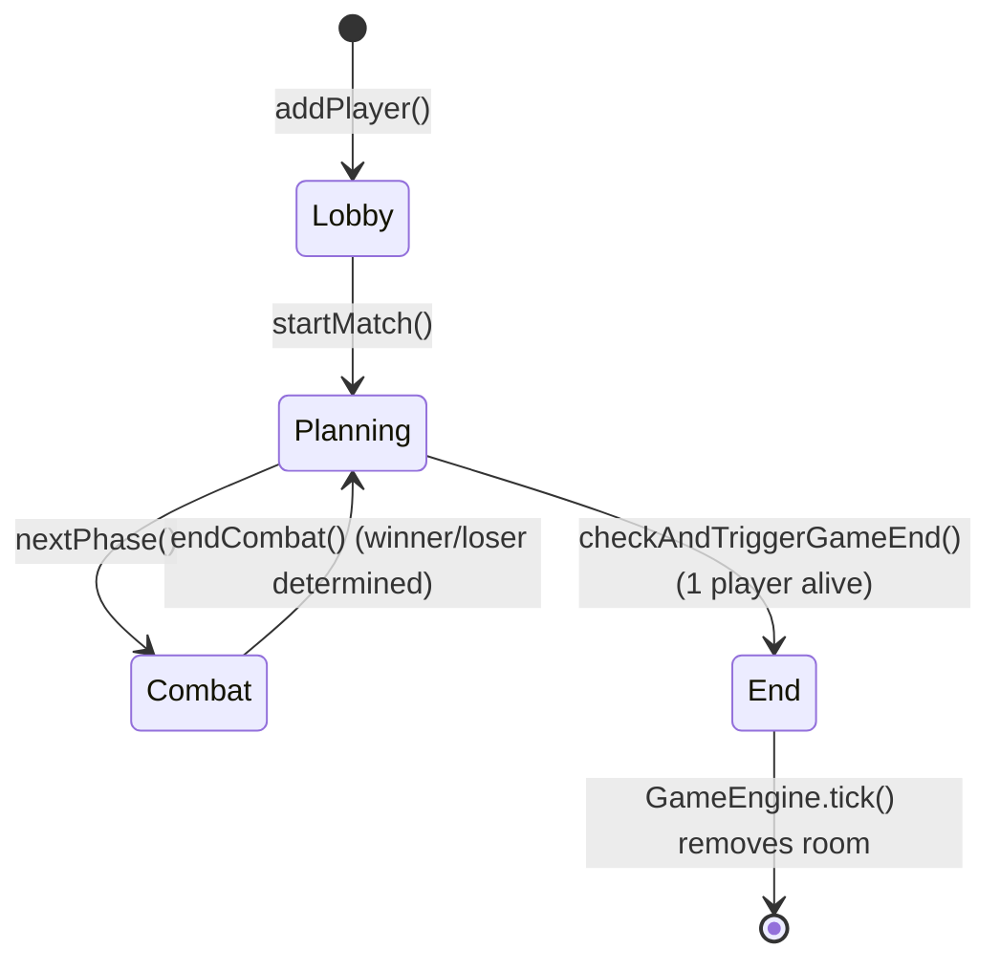

# Backend Context - One Piece Tactics

## 1. System Overview

**Role**: Stateful, Real-Time Game Server for TFT-style Auto-Battler

The backend is the **single source of truth** for all game state. It manages:
- Multi-player game rooms with in-memory state
- Round-based game loop (LOBBY → PLANNING → COMBAT → END)
- Turn-based combat simulation with ability casting
- Real-time state synchronization via WebSockets
- Theme-agnostic game engine with pluggable game modes

**No database persistence** — all game state lives in memory for the duration of a match.

---

## 2. Tech Stack & Standards

| Component | Version/Tool | Notes |
|-----------|-------------|-------|
| **Java** | 25 | Preview features enabled |
| **Spring Boot** | 4.0.1 | Latest stable |
| **Build Tool** | Maven | `pom.xml` in root |
| **WebSockets** | STOMP over SockJS | Real-time communication |
| **JSON** | Jackson | Serialization/deserialization |
| **Code Style** | Spotless (Palantir Format) | Run `mvn spotless:apply` |
| **DI Pattern** | Constructor injection only | Lombok `@RequiredArgsConstructor` |

### Java 25 Modern Features in Use
- **Records**: All DTOs and immutable data (`GameState`, `GameAction`, `PlayerState`)
- **`var` keyword**: Used extensively for local variables
- **Stream API**: Collection processing over imperative loops
- **Pattern Matching**: Not heavily used yet, but available
- **No Javadoc**: Code is self-documenting per project standards

---

## 3. Architecture Map

```
src/main/java/net/lwenstrom/tft/backend/
├── BackendApplication.java         # Spring Boot entry point (@EnableScheduling)
├── api/                             # REST API endpoints
│   └── InfoController.java         # GET /api/config, /api/traits, /api/mode
├── config/                          # Spring configuration
│   └── WebSocketConfig.java        # STOMP WebSocket setup
├── core/                            # Core game engine (theme-agnostic)
│   ├── DataLoader.java             # Loads units/traits from JSON
│   ├── GameController.java         # WebSocket message handlers + scheduled tick
│   ├── GameModeProvider.java       # Interface for theme providers
│   ├── GameModeRegistry.java       # Active mode selection (@Value game.mode)
│   ├── GameConstants.java          # Global constants (tick rate, gold, XP, etc.)
│   ├── combat/                     # Combat mechanics
│   │   ├── AbilityCaster.java      # Interface for ability execution
│   │   ├── DefaultAbilityCaster.java # Standard ability implementation
│   │   ├── TargetSelector.java     # Interface for target selection
│   │   ├── NearestEnemyTargetSelector.java # Default targeting
│   │   ├── UnitMover.java          # Interface for pathfinding
│   │   └── BfsUnitMover.java       # BFS pathfinding implementation
│   ├── engine/                     # Core game objects
│   │   ├── GameEngine.java         # Room manager + tick orchestration
│   │   ├── GameRoom.java           # Single match instance (state, players, phases)
│   │   ├── Player.java             # Player state (gold, XP, bench, board, shop)
│   │   ├── CombatSystem.java       # Combat simulation (attacks, abilities, damage)
│   │   ├── TraitManager.java       # Trait effect registration/application
│   │   ├── GenericTraitApplier.java # Generic trait stat modifiers
│   │   ├── UnitDefinition.java     # Unit blueprint (from JSON)
│   │   ├── StandardGameUnit.java   # Mutable GameUnit implementation
│   │   ├── Bench.java              # Bench slot management
│   │   ├── Grid.java               # Board grid utilities
│   │   └── ShopOdds.java           # Level-based shop probability distribution
│   ├── model/                      # Data models (mostly records)
│   │   ├── GameState.java          # Top-level state snapshot (sent to frontend)
│   │   ├── GameAction.java         # Player action (BUY, SELL, MOVE, etc.)
│   │   ├── GameUnit.java           # Interface for units
│   │   ├── GamePhase.java          # LOBBY, PLANNING, COMBAT, END
│   │   ├── ActionType.java         # BUY, SELL, MOVE, REROLL, EXP, LOCK, COLLECT_ORB
│   │   ├── AbilityDefinition.java  # Ability blueprint
│   │   ├── AbilityType.java        # DAMAGE, HEAL, BUFF, etc.
│   │   ├── Trait.java              # Active trait state
│   │   ├── TraitMetadata.java      # Trait metadata (name, description, thresholds)
│   │   ├── LootOrb.java            # Post-combat loot drops
│   │   └── ... (modifiers: Stun, Lifesteal, Execute, etc.)
│   ├── random/                     # Randomness abstraction
│   │   └── RandomProvider.java     # Interface for testable RNG
│   └── time/                       # Time abstraction
│       └── Clock.java              # Interface for testable time
└── game/                           # Game mode implementations
    ├── onepiece/                   # One Piece theme
    │   ├── OnePieceGameModeProvider.java  # Provider impl
    │   ├── OnePieceTraitLoader.java       # Custom trait registration
    │   └── traits/                 # Custom One Piece trait effects
    └── pokemon/                    # Pokemon theme (stub)
        └── PokemonGameModeProvider.java

src/main/resources/
└── data/
    ├── units_onepiece.json         # One Piece unit definitions
    ├── traits_onepiece.json        # One Piece trait metadata
    ├── units_pokemon.json          # Pokemon unit definitions
    └── traits_pokemon.json         # Pokemon trait metadata
```

---

## 4. The "Game Loop" Explained

### High-Level Flow

```mermaid
graph TD
    A[GameController.tick<br/>@Scheduled 100ms] --> B[GameEngine.tick]
    B --> C{For each GameRoom}
    C --> D[GameRoom.tick]
    D --> E{Current Phase?}
    E -->|PLANNING| F[Decrement timer<br/>Auto-advance when 0]
    E -->|COMBAT| G[CombatSystem.simulateTick<br/>Units attack/cast/move]
    E -->|LOBBY/END| H[No-op or cleanup]
    F --> I[Broadcast GameState<br/>via WebSocket]
    G --> I
    H --> I
```

### Threading Model
- **Single-threaded simulation**: All game logic runs on Spring's `@Scheduled` thread pool
- **WebSocket handlers**: Run on separate threads but queue actions for next tick
- **No race conditions**: GameRoom operations are not thread-safe but accessed sequentially

### Phase Lifecycle

1. **LOBBY**: Players join, host starts match
2. **PLANNING** (30s default):
   - Players buy/sell units, arrange board
   - Shop can be rerolled/locked
   - XP can be purchased
3. **COMBAT** (variable duration):
   - `CombatSystem` clones player boards
   - Units move toward enemies (BFS pathfinding)
   - Units attack on cooldown, gain mana, cast abilities
   - Combat ends when one side is eliminated or timeout (30s)
   - Winner/loser determined, damage applied to loser's health
   - Loot orbs spawn for winner
4. **PLANNING** (repeat): Round increments, shop refreshes with new odds
5. **END**: Final player standing wins

### Tick Rate
- **100ms** (`GameConstants.TICK_RATE_MS`)
- Combat simulation: 10 ticks/second
- Attack speed: `1.0 AS = 1 attack/second = 10 ticks between attacks`

---

## 5. Theme-Agnostic Architecture

### The GameMode System

The engine is **completely theme-agnostic**. "One Piece" is just a data skin.

**How it works**:
1. Set `GAME_MODE=onepiece` (or `pokemon`) as environment variable
2. `GameModeRegistry` reads this and finds the matching `GameModeProvider`
3. `DataLoader` loads units/traits from the provider's JSON paths
4. Custom trait effects are registered via `GameModeProvider.registerTraitEffects()`

**Key Classes**:
- `GameMode` enum: `ONEPIECE`, `POKEMON`
- `GameModeProvider` interface: Defines `getUnitsPath()`, `getTraitsPath()`, `registerTraitEffects()`
- `GameModeRegistry`: Service that holds active mode and provider map
- `DataLoader`: Loads JSON data at startup (`@PostConstruct`)

**Example**: `OnePieceGameModeProvider`
```java
@Service
public class OnePieceGameModeProvider implements GameModeProvider {
    @Override
    public GameMode getMode() { return GameMode.ONEPIECE; }
    
    @Override
    public String getUnitsPath() { return "/data/units_onepiece.json"; }
    
    @Override
    public String getTraitsPath() { return "/data/traits_onepiece.json"; }
    
    @Override
    public void registerTraitEffects(TraitManager traitManager) {
        // Register custom One Piece trait logic
        OnePieceTraitLoader.load(traitManager);
    }
}
```

---

## 6. API & Event Intermediary

### REST Endpoints

| Endpoint | Method | Response | Purpose |
|----------|--------|----------|---------|
| `/api/config` | GET | `{gameMode: "onepiece"}` | Get active game mode |
| `/api/traits` | GET | `TraitMetadata[]` | Get trait metadata |
| `/api/mode` | GET | `GameMode` | Get game mode enum |

### WebSocket Communication

**Endpoint**: `/tft-websocket`  
**Protocol**: STOMP over SockJS  
**Broker Prefix**: `/topic`  
**App Prefix**: `/app`

#### Client → Server (MessageMapping)

| Destination | Payload | Action |
|-------------|---------|--------|
| `/app/create` | `{roomId, playerName}` | Create room + join as host |
| `/app/join` | `{roomId, playerName}` | Join existing room |
| `/app/leave` | `{roomId, playerName}` | Leave room |
| `/app/start` | `{roomId, playerName}` | Start match (host only) |
| `/app/room/{id}/add-bot` | `{}` | Add bot player to room |
| `/app/room/{id}/action` | `GameAction` (see below) | Player action |

#### GameAction Payload Structure
```json
{
  "type": "BUY | SELL | MOVE | REROLL | EXP | LOCK | COLLECT_ORB",
  "playerId": "uuid",
  "unitId": "uuid",           // for SELL, MOVE
  "orbId": "uuid",            // for COLLECT_ORB
  "targetX": 0,               // for MOVE
  "targetY": 0,               // for MOVE
  "shopIndex": 0              // for BUY
}
```

#### Server → Client (Topics)

| Topic | Payload | Frequency |
|-------|---------|-----------|
| `/topic/room/{roomId}` | `GameState` | Every 100ms (tick) |
| `/topic/room/{roomId}/event` | `{type, payload}` | On specific events |

**GameState Structure** (Record, fully serialized to JSON):
```java
record GameState(
    String roomId,
    String hostId,
    GamePhase phase,           // LOBBY, PLANNING, COMBAT, END
    long round,
    long timeRemainingMs,
    long totalPhaseDuration,
    Map<String, PlayerState> players,
    Map<String, String> matchups,  // playerId -> opponentId
    List<CombatEvent> recentEvents,
    Map<String, DamageEntry> damageLog,
    GameMode gameMode
)

record PlayerState(
    String playerId,
    String name,
    int health,
    int gold,
    int level,
    int xp,
    int nextLevelXp,
    Integer place,             // null if alive, 1-8 if eliminated
    String combatSide,         // "TOP" or "BOTTOM"
    List<GameUnit> bench,
    List<GameUnit> board,
    List<Trait> activeTraits,
    List<UnitDefinition> shop,
    List<LootOrb> lootOrbs,
    boolean isGhost            // true for bot players
)
```

**Event Payload Example** (COMBAT_RESULT):
```json
{
  "type": "COMBAT_RESULT",
  "payload": {
    "winnerId": "uuid",
    "loserId": "uuid",
    "participantIds": ["uuid1", "uuid2"],
    "damageLog": {
      "unit-id-1": {"name": "Luffy", "damage": 1234},
      "unit-id-2": {"name": "Zoro", "damage": 890}
    }
  }
}
```

---

## 7. State Management Deep Dive

### Where is GameState held?

**Per-Room Instance** in `GameRoom` class:
```java
public class GameRoom {
    private GameState currentState;  // Built on-demand from mutable objects
    private final Map<String, Player> players = new ConcurrentHashMap<>();
    private Grid grid;
    private CombatSystem combatSystem;
    // ...
}
```

- `GameRoom` holds **mutable** `Player` objects, `Grid`, etc.
- `getState()` builds an **immutable snapshot** (`GameState` record) for serialization
- Frontend never modifies state — all changes flow through `GameAction` → `GameController` → `GameRoom`

### Player State Machine



---

## 8. Combat System Architecture

### Combat Initialization
```java
CombatSystem.startCombat(Collection<Player> players)
  → Clone all units from each player's board
  → Apply trait bonuses (TraitManager)
  → Position units on mirrored grids (TOP/BOTTOM)
  → Reset combat timers
```

### Combat Tick Simulation
```java
CombatSystem.simulateTick(List<Player> participants)
  → For each alive unit:
      1. Check stun status, decrement if stunned
      2. Find nearest enemy (TargetSelector)
      3. If in range: attack if cooldown ready
         - Deal damage, gain mana, accumulate damage log
      4. Else: move toward enemy (UnitMover.BFS)
      5. Check if unit can cast ability (mana >= maxMana)
         - AbilityCaster.cast(ability, caster, targets)
         - Apply damage/heal/buff/debuff
  → Remove dead units
  → Check win condition (one side eliminated)
```

### Ability Casting Flow
```java
DefaultAbilityCaster.cast()
  → Determine targets based on AbilityPattern + range
  → Apply base effect (DAMAGE, HEAL, BUFF)
  → Apply modifiers (Stun, Lifesteal, Execute, Knockback, Scaling)
  → Trigger custom effects (CustomEffectHandler)
  → Emit combat events
```

### Combat End
```java
GameRoom.handleCombatEnd()
  → Determine winner/loser (or draw)
  → Apply damage = (loser's surviving units + round) to loser's health
  → Spawn loot orbs for winner (gold or units based on ShopOdds)
  → Notify frontend via COMBAT_RESULT event
  → Advance to next PLANNING phase
```

---

## 9. Shop & Economy System

### Shop Refresh Logic
- **On round start**: `Player.refreshShop()` called for all players
- **Manual reroll**: Costs 2 gold (`GameConstants.REROLL_COST`)
- **Shop lock**: Preserves shop contents across rounds

### Shop Probability Distribution
Defined in `ShopOdds.java` — **level-dependent** odds for each unit cost tier:

| Level | 1-Cost | 2-Cost | 3-Cost | 4-Cost | 5-Cost |
|-------|--------|--------|--------|--------|--------|
| 1 | 100% | 0% | 0% | 0% | 0% |
| 2 | 70% | 30% | 0% | 0% | 0% |
| 3 | 50% | 35% | 15% | 0% | 0% |
| 4 | 35% | 35% | 25% | 5% | 0% |
| 5 | 25% | 30% | 30% | 13% | 2% |
| 6 | 18% | 27% | 30% | 20% | 5% |
| 7 | 14% | 22% | 30% | 25% | 9% |
| 8 | 12% | 18% | 27% | 28% | 15% |
| 9 | 10% | 15% | 22% | 30% | 23% |

### Auto-Upgrade System
When a player buys a unit:
1. Check bench + board for 3 copies of same unit at same star level
2. If found, combine into higher star → refund sell value of 2 units
3. Stats scale: `stat[starLevel - 1]` from UnitDefinition JSON
4. Upgrades can chain (3x 1★ → 1x 2★, then if 3x 2★ → 1x 3★)

### Loot Orbs
Spawn after combat for winner:
- **Gold orbs**: 1-2 gold per orb
- **Unit orbs**: Random unit from (player.level + 1) shop odds
- Orbs persist until collected via `COLLECT_ORB` action

---

## 10. Trait System

### How Traits Work
1. **Activation**: `TraitManager.calculateActiveTraits(List<GameUnit> units)`
   - Count trait occurrences on board
   - Check if threshold met (e.g., 2/4/6 for Pirate)
2. **Application**: `TraitManager.applyTraits(GameUnit unit, List<Trait> activeTraits)`
   - For each active trait, apply stat modifiers or custom logic
3. **Timing**:
   - Calculated at start of combat (`CombatSystem.startCombat`)
   - Recalculated if units die mid-combat (some traits)

### Generic vs Custom Traits
- **Generic**: Defined in `GenericTraitApplier` (stat bonuses read from JSON)
- **Custom**: Registered per-theme in `OnePieceTraitLoader.load(TraitManager)`

**Example Custom Trait** (Conqueror's Haki):
```java
traitManager.registerEffect("conquerors_haki", (unit, tier) -> {
    unit.setLowHpDamageBonus(0.3f * tier);
    unit.setLowHpDamageThreshold(0.4f);
});
```

---

## 11. Key File Locations

| Purpose | Absolute Path |
|---------|---------------|
| **Main Application** | `/backend/src/main/java/net/lwenstrom/tft/backend/BackendApplication.java` |
| **Game Loop Orchestrator** | `/backend/src/main/java/net/lwenstrom/tft/backend/core/engine/GameEngine.java` |
| **Room Instance** | `/backend/src/main/java/net/lwenstrom/tft/backend/core/engine/GameRoom.java` |
| **WebSocket Config** | `/backend/src/main/java/net/lwenstrom/tft/backend/config/WebSocketConfig.java` |
| **Message Handlers** | `/backend/src/main/java/net/lwenstrom/tft/backend/core/GameController.java` |
| **Combat Simulation** | `/backend/src/main/java/net/lwenstrom/tft/backend/core/engine/CombatSystem.java` |
| **Theme Provider (One Piece)** | `/backend/src/main/java/net/lwenstrom/tft/backend/game/onepiece/OnePieceGameModeProvider.java` |
| **Data Files** | `/backend/src/main/resources/data/*.json` |

---

## 12. Common Debugging Entry Points

### "How does the game loop advance?"
→ `GameController.tick()` (@Scheduled) → `GameEngine.tick()` → `GameRoom.tick()`

### "How are player actions handled?"
→ `GameController.handleAction()` → `GameRoom` or `Player` methods

### "Where is combat damage calculated?"
→ `CombatSystem.simulateTick()` → attack logic or `AbilityCaster.cast()`

### "How do traits modify units?"
→ `TraitManager.applyTraits()` → `GenericTraitApplier` or custom effect lambda

### "How does the theme system work?"
→ `GameModeRegistry` → `GameModeProvider` → `DataLoader.loadUnits()`

---

## 13. Configuration & Environment Variables

| Variable | Default | Purpose |
|----------|---------|---------|
| `GAME_MODE` | `onepiece` | Active game mode (`onepiece` or `pokemon`) |
| (None) | — | All other config is hardcoded in `GameConstants.java` |

To change game mode:
```bash
export GAME_MODE=pokemon
mvn spring-boot:run
```

---

## 14. Design Principles Summary

✅ **Theme-agnostic core**: Units, traits, abilities are data-driven  
✅ **Constructor injection only**: All DI via Lombok `@RequiredArgsConstructor`  
✅ **Records for DTOs**: `GameState`, `GameAction`, `PlayerState`, etc.  
✅ **No Javadoc**: Code is self-documenting  
✅ **Streams over loops**: Functional style for collections  
✅ **In-memory state**: No database, stateless REST, stateful WebSocket  
✅ **Single source of truth**: Backend authority, frontend renders only  

---

## 15. Testing & Development

### Run Backend
```bash
cd backend
export GAME_MODE=onepiece
mvn spring-boot:run
```

### Format Code
```bash
mvn spotless:apply
```

### Access Endpoints
- WebSocket: `ws://localhost:8080/tft-websocket`
- REST API: `http://localhost:8080/api/config`

## 16. Testability Architecture

The backend was refactored for high testability using dependency injection for side-effects:

### Time Abstraction

```java
public interface Clock {
    long currentTimeMillis();
}
// Production: SystemClock (uses System.currentTimeMillis())
// Test: MockClock (controllable time)
```

### Random Abstraction

```java
public interface RandomProvider {
    <T> void shuffle(List<T> list);
    int nextInt(int bound);
    double nextDouble();
    Random getRandom();
}
// Production: DefaultRandomProvider (java.util.Random)
// Test: SeededRandomProvider (deterministic via seed)
```

### Combat Strategy Interfaces

All combat behaviors are injectable:
- `TargetSelector`
- `UnitMover`
- `AbilityCaster`

This allows unit tests to mock specific behaviors without running full combat simulations.

---

## 17. Game Constants (`GameConstants`)

All magic numbers have been extracted into a centralized `GameConstants` class:

**Combat Constants**:
- `MANA_PER_HIT = 10`
- `ABILITY_COOLDOWN_MS = 1000L`
- `COMBAT_PHASE_MS = 25000L`

**Economy Constants**:
- `XP_PER_PHASE = 2`
- `XP_BUY_COST = 4`
- `XP_BUY_AMOUNT = 4`
- `REROLL_COST = 2`
- `STARTING_GOLD = 10`
- `BASE_INCOME = 5`
- `MAX_INTEREST = 5`

**Grid & Units**:
- `MAX_BENCH_SIZE = 9`
- `SHOP_SIZE = 5`
- `GRID_COLS = 7`
- `PLAYER_ROWS = 4`
- `COMBAT_ROWS = 8`

**Damage**:
- `BASE_COMBAT_DAMAGE = 2`

**Timing**:
- `TICK_RATE_MS = 100`
- `BASE_PLANNING_DURATION_MS = 15000L`
- `PLANNING_DURATION_INCREMENT_MS = 250L`

**Bot Configuration**:
- `BOT_STARTING_LEVEL = 2`
- `BOT_MAX_LEVEL = 9`
- `BOT_MAX_UNITS_PER_ROW = 7`

**Loot Orbs**:
- `MIN_ORB_COUNT = 2`
- `MAX_ORB_COUNT = 4`
- `ORB_GOLD_CHANCE_PERCENT = 60`
- `MIN_ORB_GOLD = 3`
- `MAX_ORB_GOLD = 8`

---

## 18. Ability System Details

### Ability Types (`AbilityType` Enum)

| Type | Effect | Value Meaning |
|------|--------|---------------|
| `DAMAGE` | Deal damage to enemies | Base damage (scaled by star level) |
| `STUN` | Target skips N combat ticks | Stun duration in ticks |
| `HEAL` | Restore HP to self or allies | Heal amount |
| `BUFF_ATK` | Increase ATK for all allied units | % increase (e.g., 20 = +20%) |
| `BUFF_SPD` | Decrease attack cooldown for allies | % increase to attack speed |

### `AbilityDefinition` Record (Star-Level Scaling)

Ability values and ranges are **explicit lists** with exactly 3 values for star levels 1/2/3:

```java
public record AbilityDefinition(
    String name,
    String description,
    AbilityType type,
    String pattern,               // SINGLE, LINE, SURROUND
    List<Integer> range,          // [r1, r2, r3] per star level
    List<Integer> values,         // [v1, v2, v3] per star level
    List<AbilityModifier> modifiers
) {
    public int getValueForLevel(int starLevel);    // Returns values[starLevel-1]
    public int getRangeForLevel(int starLevel);    // Returns range[starLevel-1]
    public String getFormattedDescription(int starLevel);
}
```

### Ability Targeting Patterns

| Pattern | DAMAGE/STUN Behavior | HEAL/BUFF Behavior |
|---------|---------------------|-------------------|
| `SINGLE` | Target nearest enemy | Heal lowest-health ally |
| `LINE` | All enemies in a line to range | All allies in line |
| `SURROUND` | All enemies within range radius | All allies within range |

### Ability Modifier System (Sealed Interface)

Modifiers enhance or alter ability behavior:

```java
@JsonTypeInfo(use = JsonTypeInfo.Id.NAME, property = "type")
public sealed interface AbilityModifier
    permits ScalingModifier, ConditionalModifier, LifestealModifier, ExecuteModifier {}
```

**Modifier Types**:

| Type | Purpose |
|------|---------|
| `SCALING` | Dynamic damage scaling based on caster/target HP/mana |
| `CONDITIONAL` | Condition-gated effects (HP thresholds, stun state) |
| `LIFESTEAL` | Heals caster based on damage dealt |
| `EXECUTE` | Bonus damage to low-HP targets |
| `KNOCKBACK` | Pushes target away |
| `STUN` | Prevents target from acting for N ticks |

**Example JSON**:
```json
{
  "modifiers": [
    { "type": "EXECUTE", "hpThreshold": [0.3, 0.35, 0.4], "bonusDamageMultiplier": [1.5, 1.75, 2.0] },
    { "type": "LIFESTEAL", "lifestealPercent": [0.2, 0.25, 0.3] }
  ]
}
```

---

## 19. Combat Phase Restrictions

### Sell Restrictions

| Unit Location | PLANNING Phase | COMBAT Phase |
|---------------|----------------|--------------|
| Bench | ✅ Can sell | ✅ Can sell |
| Board | ✅ Can sell | ❌ Cannot sell |

### Move Restrictions

| Action | PLANNING Phase | COMBAT Phase |
|--------|----------------|--------------|
| Bench ↔ Bench (swap/reorder) | ✅ Allowed | ✅ Allowed |
| Bench → Board | ✅ Allowed | ❌ Blocked |
| Board → Bench | ✅ Allowed | ❌ Blocked |
| Board ↔ Board (swap) | ✅ Allowed | ❌ Blocked |

The `Player.moveUnit()` method checks `inCombat` flag and returns early for board operations.

### Deferred Star-Up

When a unit would upgrade during COMBAT phase, the upgrade is queued and processed at the start of the next PLANNING phase via `Player.processPendingUpgrades()`.

---

## 20. Player Elimination & Game Ending

### Elimination Logic

When a player's health reaches 0:
1. `handleCombatEnd()` calls `loser.takeDamage(damage)`
2. If `loser.getHealth() <= 0`, their `place` is set to `aliveCount + 1`
3. Eliminated players are excluded from matchmaking in subsequent rounds

### Game End Condition

Checked after each combat and at start of PLANNING:
- If `alivePlayers.size() <= 1`, phase transitions to `GamePhase.END`
- Last surviving player gets `place = 1`

### Final Placement Ranking

| Place | Meaning |
|-------|--------|
| `null` | Still playing |
| `1` | Winner (last standing) |
| `2-8` | Elimination order (lower = later elimination) |

---

## 21. Ghost/Clone Matchmaking System

### Purpose

When there's an **odd number of alive players**, a "ghost" (clone) is created so every player has an opponent.

### How It Works

1. At combat phase start, alive players are shuffled and paired
2. If one player remains unpaired (odd count):
   - A random **donor** is selected from paired players
   - `donor.createGhost()` creates a clone of that player
   - The unpaired player fights the ghost

### Ghost Properties

```java
public Player createGhost() {
    Player ghostPlayer = new Player(this.name, this.dataLoader, this.randomProvider);
    ghostPlayer.setGhost(true);
    ghostPlayer.setHealth(this.health);
    ghostPlayer.setLevel(this.level);
    
    for (GameUnit unit : this.boardUnits) {
        GameUnit cloned = unit.cloneUnit();
        ghostPlayer.boardUnits.add(cloned);
        ghostPlayer.grid.placeUnit(cloned, cloned.getX(), cloned.getY());
    }
    return ghostPlayer;
}
```

**Key behaviors**:
- `ghost` flag is `true`
- Ghosts are included in `GameState.players` for UI rendering
- **Ghosts don't take damage**: If a ghost loses, the original donor is not penalized
- Ghosts are **not added to `players` map** (only exist in `activeCombats`)

---

## 22. Bench System (`Bench` Class)

### Fixed-Size Slot Architecture

The bench uses a dedicated `Bench` class with **null-safe operations** and a fixed-size array (9 slots):

```java
public class Bench {
    private final GameUnit[] slots = new GameUnit[GameConstants.MAX_BENCH_SIZE];
    
    public record BenchEntry(int index, GameUnit unit) {}
    
    public Optional<Integer> findFirstEmptySlot() { ... }
    public Optional<GameUnit> get(int slot) { ... }
    public void set(int slot, GameUnit unit) { ... }
    public void swap(int slotA, int slotB) { ... }
    public Optional<BenchEntry> findUnit(String unitId) { ... }
    public Stream<GameUnit> units() { ... }
}
```

This design enables **slot-based swapping** where units maintain specific positions.

### Bench Operations

| Operation | Method | Frontend Payload |
|-----------|--------|------------------|
| Buy → Bench | `Player.buyUnit(shopIndex)` | Finds first empty slot |
| Bench → Board | `Player.moveUnit(unitId, x, y)` | `targetY >= 0` |
| Board → Bench | `Player.moveUnit(unitId, x, -1)` | `targetX = slot, targetY = -1` |
| Bench ↔ Bench | `Player.moveUnit(unitId, slot, -1)` | Swaps using `Bench.swap()` |

---

## 23. Bot AI & Roster System

### Bot Roster Logic

Bots use **level-based shop odds** when spawning units, ensuring fair play:

**Bot Starting State** (`GameRoom.startMatch()`):
- Level: `BOT_STARTING_LEVEL = 2`
- Unit selection: Uses `ShopOdds.rollUnit()` with bot's current level

**Bot Roster Refresh** (`GameRoom.refreshBotRoster()`):
- Triggered each PLANNING phase
- Bot level increments by 1 per round (capped at `BOT_MAX_LEVEL = 9`)
- Units selected using same shop probability distribution as players
- Low probability for 2-star/3-star units:
  - 10% chance for 2-star unit
  - 2% chance for 3-star unit

**Bot Unit Placement**:
- Units fill board from left-to-right, top-to-bottom
- Max units per row: `BOT_MAX_UNITS_PER_ROW = 7`

---

## 24. Damage Tracking System

### How It Works

`CombatSystem` tracks all damage dealt during combat via `damageLog`:

```java
public record DamageEntry(String unitName, String definitionId, String ownerId, int damage) {}

private Map<String, DamageEntry> damageLog;
```

- Damage accumulates from both **auto-attacks** and **abilities**
- Negative damage values represent **healing**
- Log is cleared at `startCombat()` and included in `CombatResult`

### Data Flow

1. `CombatSystem.simulateTick()` calls `accumulateDamage()` on each hit
2. On combat end, `CombatResult.damageLog()` is passed to `GameRoom.handleCombatEnd()`
3. `CombatResultListener.onCombatResult()` emits damageLog to frontend via WebSocket
4. Live damage is also synced in `GameState.damageLog` every tick during combat

---

## 25. Loot Orb System Details

### Records

```java
public enum LootType { GOLD, UNIT }
public record LootOrb(String id, int x, int y, LootType type, String contentId, int amount) {}
```

### Spawning Logic (`GameRoom.spawnLootOrbsForPlayer`)

- Orbs spawn on **even rounds** (round 2, 4, 6, ...) at the start of PLANNING phase
- Each player receives **1-3 orbs** randomly placed on their grid (top half, rows 0-3)
- **60% chance**: Gold orb (3-8 gold)
- **40% chance**: Unit orb (random unit from player level+1 pool)

### Collection (`Player.collectOrb`)

- Triggered via `COLLECT_ORB` action from frontend
- **Gold orbs**: Add gold to player
- **Unit orbs**: Add unit to bench (if space), otherwise refund as gold

### Loot Orb Probability Changes

Loot orbs use **player level + 1** shop odds for unit drops:

```java
// In GameRoom.spawnLootOrbsForPlayer()
if (randomProvider.nextDouble() < 0.4) { // 40% chance for unit orb
    var unitDef = ShopOdds.rollUnit(
        dataLoader.getUnitDefinitions(),
        player.getLevel() + 1, // Use level+1 for slightly better odds
        randomProvider
    );
}
```

This ensures loot orbs provide slightly better quality units than the player's current shop.

---

## 26. Grid System

| Constant | Value | Notes |
|----------|-------|-------|
| `Grid.COLS` | 7 | Board width |
| `Grid.PLAYER_ROWS` | 4 | Each player's half |
| `Grid.COMBAT_ROWS` | 8 | Full combat board (4 + 4) |

**Planning Phase**: Each player sees their own 7×4 grid.

**Combat Phase**: Grids are merged:
- Player 1 (TOP): Units mirrored to rows 0-3
- Player 2 (BOTTOM): Units placed on rows 4-7

---

**END OF BACKEND_CONTEXT.md**
