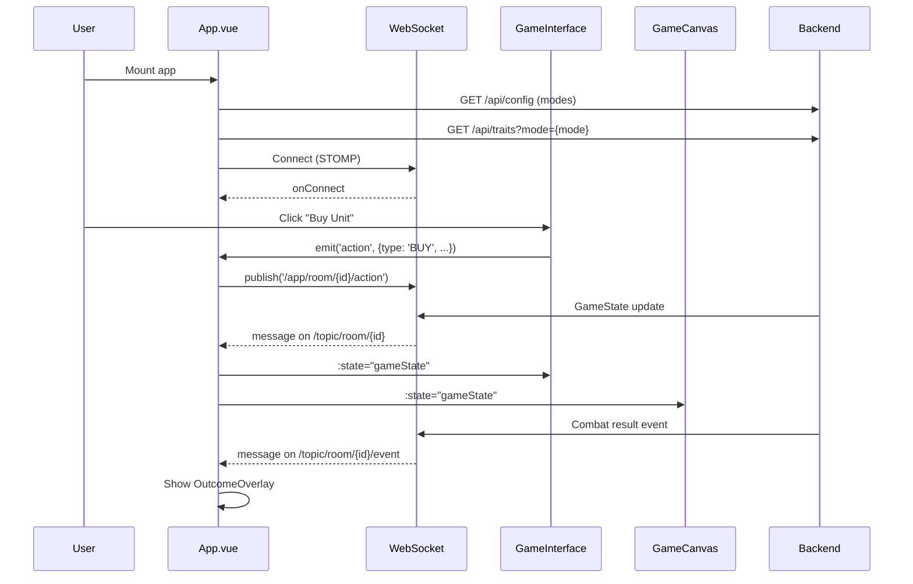

# Frontend Context — OnePieceTactics Vue.js Implementation

> **Last Updated:** 2026-06-28
> **Purpose:** Comprehensive architectural blueprint and source of truth for AI developers working on the Vue.js 3 frontend.
> **Recent Scope:** Adapted for the last 10 commits through `6b00ddb` (`Apply Pokemon type effectiveness to damage`).

---

## 1. High-Level Summary

**OnePieceTactics** is a **real-time multiplayer auto-battler** game frontend built with **Vue 3** + **TypeScript** + **Vite**. It renders live game state received from a Spring Boot backend via **STOMP WebSockets**, allowing players to build teams, position units, and spectate automated combat rounds.

**Primary Goal:**  
Deliver a responsive, visually rich UI that reflects backend-authoritative game state while providing smooth drag-and-drop unit management, real-time combat animations, and multi-theme support (One Piece, Pokemon).

---

## 2. Tech Stack

| Technology | Version | Purpose |
|------------|---------|---------|
| **Vue.js** | 3.4+ | Component framework using Composition API + `<script setup>` |
| **TypeScript** | 5.2+ | Type safety for components, state, and WebSocket messages |
| **Vite** | 5.0+ | Build tool and dev server with HMR |
| **Pinia** | 2.1+ | **NOT USED** — State is managed via reactive `ref()` in `App.vue` |
| **@stomp/stompjs** | 7.0+ | WebSocket client for STOMP protocol |
| **No Router** | N/A | Single-page app with reactive view switching; hash-only standalone route for animation gallery |
| **No UI Framework** | N/A | Vanilla CSS with scoped styles (no Tailwind) |
| **ESLint** | 9.x | Vue/TypeScript linting via `eslint.config.ts` |

**Build Configuration:**
- Strict TypeScript mode enabled (`strict: true`)
- Path alias `@/*` maps to `./src/*`
- Proxy configuration for `/ws` (WebSocket) and `/api` (REST) to `localhost:8080`
- `VITE_WS_URL` can override the derived WebSocket URL
- `VITE_GIT_TAG`, `VITE_GIT_COMMIT`, and `VITE_BUILD_TIME` are injected for `VersionDisplay.vue`

---

## 3. Directory Structure (`folder-structure.md`)

```
frontend/
├── public/                      # Static assets served at root
│   ├── assets/
│   │   └── units/              # Unit character icons organized by theme
│   │       ├── onepiece/       # One Piece character portraits
│   │       └── pokemon/        # Pokemon character portraits + generation prompt
│   │           └── _generated_batches/  # Ignored scratch output for batch icon work
│   ├── favicon.svg             # Default favicon (One Piece theme)
│   └── pokeball.png            # Pokemon theme favicon
│
├── src/
│   ├── main.ts                 # App entry point (minimal - mounts App.vue)
│   ├── App.vue                 # 🔴 ROOT COMPONENT - WebSocket, route-like view switching, theme/meta orchestration
│   ├── style.css               # Global styles (font, background, box-sizing)
│   │
│   ├── components/             # Vue SFCs (Single File Components)
│   │   ├── Lobby.vue           # Room creation/joining screen
│   │   ├── WaitingRoom.vue     # Pre-game lobby (waiting for players)
│   │   ├── GameInterface.vue   # 🔴 MAIN GAME UI - shop, bench, stats, controls
│   │   ├── GameCanvas.vue      # 🔴 COMBAT BOARD - grid, units, animations
│   │   ├── PhaseAnnouncement.vue  # Phase transition overlays
│   │   ├── PlayerList.vue      # Right-side player health leaderboard
│   │   ├── TraitSidebar.vue    # Left-side active trait indicators
│   │   ├── UnitTooltip.vue     # Hoverable unit detail tooltip
│   │   ├── EndScreen.vue       # Game-over leaderboard
│   │   ├── VersionDisplay.vue  # Git version tag display (lobby only)
│   │   └── game/               # Sub-components for combat features
│   │       ├── CombatEffectsCanvas.vue # 🔴 CANVAS VFX - attacks, ultimates, heal/shield/death effects
│   │       ├── UltimateGallery.vue    # Standalone hash route previewing attacks/ultimates
│   │       ├── AttackAnimation.vue    # Legacy/older DOM attack effect component; current board uses canvas
│   │       ├── DamageReport.vue       # Post-combat damage breakdown
│   │       └── OutcomeOverlay.vue     # Combat result (WON/LOST/DRAW)
│   │
│   ├── types/                  # TypeScript type definitions
│   │   ├── game.ts             # 🔴 CORE TYPES - GameState, GameUnit, GameAction, etc.
│   │   ├── combatEffects.ts    # Normalized event contract consumed by CombatEffectsCanvas
│   │   └── index.ts            # Re-exports types for convenience
│   │
│   ├── utils/                  # Utility functions
│   │   ├── iconUtils.ts        # Unit icon path resolution (theme-aware)
│   │   └── colorUtils.ts       # Rarity colors, team colors
│   │
│   └── data/                   # Static/semi-static data and configs
│       ├── traitData.ts        # Trait definitions fetched from backend
│       ├── shopOdds.ts         # Shop probability tables (by level)
│       ├── animationConfig.ts  # Animation styles for One Piece and Pokemon attacks/abilities
│       ├── ultimateGalleryRoster.ts        # One Piece gallery roster
│       └── pokemonUltimateGalleryRoster.ts # Pokemon gallery roster derived from backend units JSON
│
├── vite.config.ts              # Vite build config + proxy rules
├── tsconfig.json               # TypeScript compiler options
├── eslint.config.ts            # ESLint flat config for Vue/TypeScript
├── package.json                # Dependencies and scripts
└── Dockerfile                  # Production build container
```

---

## 4. Key Architectural Decisions

### 4.1 State Management Strategy

**❌ NO Pinia/Vuex Store**  
Despite Pinia being listed in dependencies, the application **does not use it**. All state is managed via **reactive primitives** in the root component.

**✅ Centralized State in `App.vue`**

```typescript
// App.vue
const gameState = ref<GameState | null>(null)  // Backend-authoritative game state
const isConnected = ref(false)                 // WebSocket connection status
const currentView = ref<'lobby' | 'game'>('lobby')  // View router
const encounterResult = ref<'WON' | 'LOST' | 'DRAW' | null>(null)  // Combat outcome
const availableModes = ref<GameMode[]>(['onepiece', 'pokemon'])
const activeTraitMode = ref<GameMode | null>(null)
const viewedPlayerId = ref<string | null>(null)      // Local board spectating target
```

**State Flow:**
1. `App.vue` establishes WebSocket connection on mount
2. It fetches `/api/config` for available/default game modes, then connects to STOMP
3. Subscribes to `/topic/room/{roomId}` for full `GameState` updates
4. When `gameState.gameMode` changes, `App.vue` updates document metadata and fetches `/api/traits?mode={mode}`
5. `GameState` is passed down via props to child components (`GameInterface`, `GameCanvas`)
6. Components derive computed properties from `GameState` (e.g., `myPlayer`, `renderedUnits`)
7. `GameInterface` emits local viewed-player changes upward so `App.vue` can point the damage report at the spectated combat.
8. User actions emit events upward, which `App.vue` publishes to backend via WebSocket

**Why This Approach?**
- **Backend Authority:** All game logic lives on the server; frontend is a "dumb renderer"
- **Simplicity:** No need for complex state mutations or actions
- **Real-Time Sync:** WebSocket updates replace the entire `GameState` object


### 4.2 Component Architecture

**Smart vs. Dumb Components:**

| Type | Components | Responsibilities |
|------|-----------|------------------|
| **Smart** (Container) | `App.vue`, `GameInterface.vue`, `GameCanvas.vue`, `UltimateGallery.vue` | WebSocket communication, state derivation, event handling, gallery preview state |
| **Dumb** (Presentational) | `UnitTooltip.vue`, `PhaseAnnouncement.vue`, `TraitSidebar.vue`, `PlayerList.vue`, `OutcomeOverlay.vue` | Rendering based on props/computed data, minimal side effects |

**Composition API Pattern:**

All components use `<script setup lang="ts">` (SFC `<script setup>` RFC):
```vue
<script setup lang="ts">
import { computed, ref } from 'vue'
import type { GameState, PlayerState } from '../types'

const props = defineProps<{ state: GameState | null }>()
const emit = defineEmits(['action'])

const myPlayer = computed((): PlayerState | null => {
  return Object.values(props.state.players).find(p => p.name === PLAYER_NAME) ?? null
})
</script>
```

**No Composables/Hooks:**  
Despite Composition API usage, the project **does not use custom composables** (e.g., `useWebSocket`, `useGameState`). All logic is inline in components.


### 4.3 Communication with Backend

**Protocol: STOMP over WebSocket**

```typescript
// App.vue - Connection Setup
const client = new Client({
  brokerURL: wsUrl,  // VITE_WS_URL or ws(s)://{host}/ws
  onConnect: () => { isConnected.value = true },
  onDisconnect: () => { isConnected.value = false }
})
client.activate()
```

**Message Patterns:**

| Direction | Destination | Payload | Purpose |
|-----------|------------|---------|---------|
| **Subscribe** | `/topic/room/{roomId}` | `GameState` JSON | Full game state updates (every tick) |
| **Subscribe** | `/topic/room/{roomId}/event` | `GameEvent` JSON | One-time events (combat results, errors) |
| **Publish** | `/app/create` | `{ roomId, playerName }` | Create new game room |
| **Publish** | `/app/join` | `{ roomId, playerName }` | Join existing room |
| **Publish** | `/app/start` | `{ roomId, playerName }` | Start game (host only) |
| **Publish** | `/app/room/{id}/action` | `GameAction` | Player actions (BUY, MOVE, SELL, etc.) |
| **Publish** | `/app/room/{id}/mode` | `{ playerName, gameMode }` | Host changes waiting-room game mode |
| **Publish** | `/app/leave` | `{ roomId, playerName }` | Leave room and clear local subscriptions |

The backend binds create/join to the STOMP session id and rejects later action/start/mode messages whose requested player does not match that session. Frontend still sends `playerId` in `GameAction`, but it is not an authority boundary.

**REST Bootstrap:**
- `GET /api/config` returns `availableModes` and `defaultGameMode` for the waiting room.
- `GET /api/traits?mode={onepiece|pokemon}` hydrates `TRAIT_DATA` for the active mode.
- The Vite dev server rewrites `/ws` to backend `/tft-websocket` and proxies `/api` unchanged.

**GameAction Structure:**
```typescript
interface GameAction {
  type: 'BUY' | 'SELL' | 'MOVE' | 'REROLL' | 'EXP' | 'LOCK' | 'COLLECT_ORB'
  playerId: string
  unitId?: string       // For MOVE, SELL
  targetX?: number      // For MOVE (0-8)
  targetY?: number      // For MOVE (-1 = bench, 0-2 = backend board row)
  shopIndex?: number    // For BUY (0-4)
  orbId?: string        // For COLLECT_ORB
}
```


### 4.4 Drag-and-Drop System

**Grid-Based Positioning:**
- 9×6 grid (`GRID_COLS = 9`, `GRID_ROWS = 6`)
- Rows 0-2: Enemy half
- Rows 3-5: Player half (`PLAYER_ROWS = 3`)
- Bench: Virtual row -1 (9 slots)

**Drag Sources:**
1. **Bench Units:** `GameInterface.vue` handles bench drag start/end
2. **Board Units:** `GameCanvas.vue` handles grid drag start/end

**Drop Targets:**
1. **Grid Cells:** Planning phase only, backend validates legal moves
2. **Bench Slots:** Swap/move units in bench
3. **Sell Zone:** Fixed UI element below bench

When `GameInterface` is spectating another player, the bottom controls are hidden and `GameCanvas` receives `isReadOnly=true`; board drag/drop highlights, drops, and loot collection are disabled until Home is clicked.

**Data Transfer:**
```typescript
evt.dataTransfer.setData('unitId', unit.id)
evt.dataTransfer.setDragImage(img, 25, 25)  // Use unit portrait
```

**Coordinate Translation:**
```typescript
// Visual Y (3-5) → Backend Y (0-2) during Planning Phase
const backendY = visualY - PLAYER_ROWS  // PLAYER_ROWS = 3
emit('move', { unitId, x, y: backendY })
```


### 4.5 Animation System

**Combat Visual Pipeline:**

The current board and standalone gallery use `CombatEffectsCanvas.vue` for layered canvas effects. `AttackAnimation.vue` still exists under `components/game`, but there are no live imports of it in `src`; treat it as legacy unless intentionally reintroduced.

1. Backend sends `GameState.recentEvents` with `CombatEvent` entries (`DAMAGE`, `SKILL`, `DEATH`, `MOVE`, `HEAL`, `SHIELD`).
2. `GameCanvas.vue` watches `recentEvents`, deduplicates by timestamp, resolves source/target units from current, dying, or previous unit maps, and normalizes each event into `NormalizedCombatVisualEvent`.
3. Normalization attaches grid pixel points, source/target render data, attack config, ability config, ability pattern, star level, intensity, batch size, and crowded-board flags.
4. `CombatEffectsCanvas.vue` consumes normalized events and renders layered effects (`ground`, `trail`, `impact`, `over-unit`) with requestAnimationFrame.
5. `GameCanvas.vue` still owns DOM unit feedback: hit flash, caster glow, attacking lunge, floating skill names, floating heals, death fade, and star-up celebrations.

**Canvas Effect Behavior:**
- Auto-attacks use `getAttackConfig(definitionId)` from `animationConfig.ts`; Pokemon attacks fall back through type/style maps such as grass, fire, water, electric, psychic, poison, ground, ice, ghost, bug, fighting, dragon, steel, normal.
- Ultimates use `getAbilityConfig(definitionId)`, including One Piece signature styles and Pokemon `POKEMON_*` ability effect styles.
- Expensive effects scale by unit cost and star level, with particle and active-effect caps (`MAX_PARTICLES`, `MAX_ACTIVE_EFFECTS`) plus simplified rendering on crowded boards.
- Healing, shield, and death are first-class canvas events, not just floating text.
- Screen shake is driven by ability config and dampened when the board is crowded.

**Death Animations:**
```typescript
// GameCanvas.vue
const dyingUnits = ref<Set<string>>(new Set())
const DEATH_ANIMATION_DURATION = 600  // ms

// Unit fades out with scale transform before removal
function triggerDeathAnimation(unit: GameUnit) {
  dyingUnits.value.add(unit.id)
  setTimeout(() => dyingUnits.value.delete(unit.id), 600)
}
```

**Star-Up Celebrations:**
```typescript
// Triggered when unit combines to 2★ or 3★
const starUpUnits = ref<Set<string>>(new Set())
const STAR_UP_ANIMATION_DURATION = 1200  // ms

// Particle burst animation
<div v-if="isStarringUp(unit.id)" class="star-up-burst">
  <span v-for="i in 8" class="star-particle" :style="{ '--particle-index': i }"></span>
</div>
```


### 4.6 Multi-Theme Support

**Theme Switching Mechanism:**

The application dynamically adapts to backend `gameMode`, waiting-room mode choices, and the standalone gallery hash route:

```typescript
// App.vue - Metadata and theme class
applyThemeMeta(gameState.value.gameMode)
const themeClass = computed(() => `theme-${gameState.value?.gameMode ?? 'generic'}`)
```

**Icon Resolution:**
```typescript
// utils/iconUtils.ts
export function getUnitIconPath(definitionId: string, gameMode?: string): string {
  const theme = gameMode || 'onepiece'
  return `/assets/units/${theme}/${definitionId}.png`
}
```

**Trait Data Loading:**
```typescript
// App.vue - Trait Fetching
const traitsRes = await fetch(`/api/traits?mode=${mode}`)
const traits = await traitsRes.json()
setTraitData(traits)  // Populates global TRAIT_DATA object
```

**Mode-Specific Mechanics:**
- `WaitingRoom.vue` receives `availableModes` and `defaultMode` from `/api/config`; mode changes publish to `/app/room/{id}/mode`.
- `theme-generic`, `theme-onepiece`, and `theme-pokemon` CSS custom properties live in `App.vue`.
- `GameMode` is a strict union: `'onepiece' | 'pokemon'`.
- Pokemon traits use `TraitDefinition.type = 'type'` in addition to One Piece-style `origin` and `class`; `targetScope` and `effectType` are available for richer tooltip/metadata display.
- `TraitSidebar.vue` counts unique unit lines using `lineId || definitionId || name`, so evolved Pokemon forms do not over-count the same evolution line.
- `pokemonUltimateGalleryRoster.ts` imports `backend/src/main/resources/data/units_pokemon.json` and expands both base units and `forms` into gallery entries.


### 4.7 Styling Approach

**❌ NO CSS Framework**  
The project uses **Vanilla CSS** with:
- Scoped styles (`<style scoped>`) in SFCs
- Global resets in `style.css`
- CSS custom properties for theming (`--rarity-color`)
- Flexbox and Grid layouts

**Color Coding:**

**Unit Rarity Colors:**
```typescript
// utils/colorUtils.ts
export const RARITY_COLORS = {
  1: '#94a3b8',  // Gray
  2: '#22c55e',  // Green
  3: '#3b82f6',  // Blue
  4: '#a855f7',  // Purple
  5: '#eab308'   // Gold
}
```

**Team Identification:**
```typescript
export const TEAM_COLORS = {
  FRIENDLY: '#3b82f6',  // Blue
  OPPONENT: '#ef4444'   // Red
}
```

**Visual Effects:**
- **2-Star Units:** Pulsing halo ring effect
- **3-Star Units:** Flowing gradient overlay
- **Cost-Based Borders:** Unit borders match rarity color
- **Status Effects:** Grayscale filter for stun, glow for buffs


---

## 5. Critical File Paths

### 5.1 Entry Points

| File | Purpose |
|------|---------|
| [index.html](index.html) | HTML shell, mounts `#app` |
| [src/main.ts](src/main.ts) | Minimal entry—creates Vue app from `App.vue` |
| [src/App.vue](src/App.vue) | **ROOT COMPONENT** — WebSocket setup, view routing, event handling |

### 5.2 Core Game Components

| File | Lines | Responsibilities |
|------|-------|-----------------|
| [GameInterface.vue](src/components/GameInterface.vue) | ~1200 | Shop UI, bench management, drag-and-drop, player stats, buy/sell/reroll actions |
| [GameCanvas.vue](src/components/GameCanvas.vue) | ~1100 | 9×6 board rendering, unit positioning, event normalization, DOM feedback, loot orbs, tooltips |
| [CombatEffectsCanvas.vue](src/components/game/CombatEffectsCanvas.vue) | ~2000 | Canvas renderer for attack, ultimate, heal, shield, death, particle, and shake effects |
| [UltimateGallery.vue](src/components/game/UltimateGallery.vue) | ~600 | Standalone hash route for previewing One Piece/Pokemon attacks and ultimates |
| [AttackAnimation.vue](src/components/game/AttackAnimation.vue) | legacy | Older DOM attack/ability effect component; currently not imported by the live board |

### 5.3 Type Definitions

| File | Key Exports |
|------|------------|
| [types/game.ts](src/types/game.ts) | `GameState`, `GameUnit`, `PlayerState`, `GameAction`, `GameEvent`, `UnitDefinition`, `ActiveTrait`, `LootOrb` |
| [types/combatEffects.ts](src/types/combatEffects.ts) | `NormalizedCombatVisualEvent`, `EffectIntensity`, `RenderLayer`, canvas point contracts |

**Type Sync:**  
TypeScript types mirror Java backend models (`GameState.java`, `GameUnit.java`) to ensure compile-time correctness of WebSocket payloads.

### 5.4 Configuration Files

| File | Purpose |
|------|---------|
| [vite.config.ts](vite.config.ts) | Dev server proxy, build options |
| [tsconfig.json](tsconfig.json) | TypeScript strict mode, path aliases |
| [eslint.config.ts](eslint.config.ts) | ESLint flat config |
| [package.json](package.json) | Dependencies, build scripts |
| [Dockerfile](Dockerfile) | Production build with version injection |

---

## 6. Unit Icon Asset Creation Guidelines

All unit icons follow a standardized **High-Quality Modern Pixel Art Style** to ensure visual consistency across the shop and game grid.

### 6.1 Visual Style Constraints

- **Art Style**: High-quality modern pixel art with clean bold digital lines and distinct pixel grid
- **Shading**: Cel-shaded technique for depth
- **Framing**: Centered head-and-shoulders portrait, filling ~80% of frame
- **Outline**: Thick black outline for high contrast and readability on game grid
- **Background**: Solid flat very light color (no gradients) determined by unit cost
- **Resolution**: 1024×1024 (scaled down for web use)

### 6.2 Background Colors by Unit Cost

| Cost | Prompt Color Description | HEX Code | Visual Example |
|------|-------------------------|----------|----------------|
| **1★** | `solid flat very light grey background` | `#f0f0f0` | Gray/Slate |
| **2★** | `solid flat very light green background` | `#f0fdf4` | Mint Green |
| **3★** | `solid flat very light blue background` | `#f0f9ff` | Sky Blue |
| **4★** | `solid flat very light purple background` | `#faf5ff` | Lavender |
| **5★** | `solid flat very light orange background` | `#fff7ed` | Cream Orange |

### 6.3 AI Generation Prompt Template

**Single Character:**
```
High-quality modern pixel art portrait of [Character Name] from [Theme], head and shoulders, 
centered, filling the frame, extremely clean bold lines, distinct pixel grid, cel-shaded, 
[Visual Characteristic], solid flat very light [color] background ([HEX code]), 
high-fidelity pixelated illustration, 1024x1024. No text, no frames, no gradients, sharp edges.
```

**Example:**
```
High-quality modern pixel art portrait of Luffy from One Piece, head and shoulders, centered, 
filling the frame, extremely clean bold lines, distinct pixel grid, cel-shaded, straw hat and 
cheerful expression, solid flat very light grey background (#f0f0f0), high-fidelity pixelated 
illustration, 1024x1024. No text, no frames, no gradients, sharp edges.
```

### 6.4 Batch Generation Workflow (4-Quadrant Grid)

To optimize generation costs and maintain consistency, generate 4 characters at once in a quadrant layout.

**4-Quadrant Prompt Template:**
```
A single 1024x1024 image divided into 4 equal quadrants. Each quadrant contains a high-quality 
modern pixel art portrait of a different [Theme] character: [Character 1] (Top-Left), 
[Character 2] (Top-Right), [Character 3] (Bottom-Left), [Character 4] (Bottom-Right). 
Each character is head and shoulders, centered, filling its quadrant, extremely clean bold lines, 
distinct pixel grid, cel-shaded, [Visual Characteristics], [Background Descriptions including HEX 
codes]. No text, no frames, no gradients, sharp edges. 1024x1024 total resolution.
```

**Splitting Quadrants:**

Use the [`scripts/quadrant_cutter.py`](../scripts/quadrant_cutter.py) utility to split the generated image:

```bash
# From project root
python3 scripts/quadrant_cutter.py <generated_image_path> <output_directory>
```

**Output:**
- `*_q1.png` (Top-Left)
- `*_q2.png` (Top-Right)
- `*_q3.png` (Bottom-Left)
- `*_q4.png` (Bottom-Right)

**Post-Processing:**
1. Rename quadrant files to match `definitionId` (e.g., `luffy_v1.png`)
2. Move to appropriate theme folder: `frontend/public/assets/units/{theme}/`
3. Verify background color matches unit cost
4. Optionally compress using `scripts/compress_images.py`

### 6.5 Asset Organization

```
public/assets/units/
├── onepiece/           # One Piece theme icons
│   ├── luffy_v1.png
│   ├── zoro_v1.png
│   └── nami_v1.png
└── pokemon/            # Pokemon theme icons
    ├── ICON_GENERATION_PROMPT.md
    ├── _generated_batches/  # ignored scratch output
    ├── pikachu.png
    ├── charizard.png
    └── mewtwo.png
```

**Icon Resolution:**
```typescript
// utils/iconUtils.ts
export function getUnitIconPath(definitionId: string, gameMode?: string): string {
  const theme = gameMode || 'onepiece'
  return `/assets/units/${theme}/${definitionId}.png`
}
```

> [!IMPORTANT]
> **AI Development Instruction: Character Icon Generation**
> 
> When asked to add new units or update icons:
> 1. Use the **4-Quadrant Prompt Template** to generate 4 characters at once
> 2. Ensure each quadrant specifies the correct HEX background color based on unit cost
> 3. Use `scripts/quadrant_cutter.py` to split the generated image
> 4. Rename `_qN.png` files to match `definitionId` from `units_{theme}.json`
> 5. Move to `public/assets/units/{theme}/{definitionId}.png`
> 6. Compress large PNGs before committing
> 7. Verify consistency: background color, pixel art style, centering

---

## 7. Data Flow Diagram



---

## 8. Common Development Patterns

### 8.1 Accessing Current Player Data

```typescript
// In any component receiving `state` prop
const myPlayer = computed((): PlayerState | null => {
  if (!props.state?.players) return null
  return Object.values(props.state.players).find(
    p => p.name === props.currentPlayerName
  ) ?? null
})
```

### 8.2 Emitting Player Actions

```typescript
// Component emits to parent
emit('action', { 
  type: 'MOVE', 
  unitId: 'unit-123', 
  targetX: 3, 
  targetY: 2, 
  playerId: myPlayer.value.playerId 
})

// App.vue publishes to backend
client.value.publish({
  destination: `/app/room/${currentRoomId.value}/action`,
  body: JSON.stringify(action)
})
```

### 8.3 Conditional Rendering by Phase

```typescript
// Show different UI based on game phase
<template v-if="state.phase === 'PLANNING'">
  <!-- Shop, bench, drag-and-drop enabled -->
</template>
<template v-else-if="state.phase === 'COMBAT'">
  <!-- Read-only board, animations active -->
</template>
```

### 8.4 Computing Derived State

```typescript
// Render units with coordinate transformation for combat
const renderedUnits = computed((): RenderedUnit[] => {
  const isCombat = props.state.phase === 'COMBAT'
  const viewedId = props.viewedPlayerId || props.actingPlayerId
  const viewedPlayer = props.state.players[viewedId]
  const shouldFlip = isCombat && viewedPlayer?.combatSide === 'TOP'
  
  return allUnits.map(u => ({
    ...u,
    visualX: u.x,
    visualY: shouldFlip ? (GRID_ROWS - 1 - u.y) : u.y + PLAYER_ROWS,
    isMine: u.ownerId === viewedId
  }))
})
```

### 8.5 Board Spectating

- `PlayerList.vue` emits `select-player` when clicking an alive non-ghost player row; clicking yourself returns home.
- `GameInterface.vue` owns local `viewedPlayerId`, validates it against live `GameState`, shows the `Viewing {name}` notice with a Home button, hides the bottom shop/bench panel while spectating, and sends the effective viewed id to `GameCanvas`.
- `GameCanvas.vue` separates `actingPlayerId` from `viewedPlayerId`: the viewed player controls board orientation and team coloring, while the acting player remains the only legal drag/action owner.
- During planning, only the viewed player's board renders on the bottom half. During combat, the viewed player and `state.matchups[viewedPlayerId]` render, with Y flipped when the viewed player is `TOP` so their units stay bottom.
- `App.vue` tracks the viewed player id emitted by `GameInterface`; the right-side `DamageReport.vue` uses the viewed player and their matchup, while the outcome overlay remains tied to the real player.

---

## 9. Build and Deployment

### Development Server

```bash
npm run dev
```
- Runs on `http://localhost:5173`
- Proxies `/ws` and `/api` to `http://localhost:8080`
- Hot Module Replacement (HMR) enabled

### Production Build

```bash
npm run build
```
- Output: `dist/` directory
- TypeScript type-checking (`vue-tsc --noEmit`)
- Minified assets with hashed filenames

### Docker Build

```dockerfile
# Dockerfile
FROM node:18 AS build
WORKDIR /app
COPY package*.json ./
RUN npm ci
COPY . .
ARG VITE_GIT_TAG
ARG VITE_GIT_COMMIT
ARG VITE_BUILD_TIME
ENV VITE_GIT_TAG=$VITE_GIT_TAG
ENV VITE_GIT_COMMIT=$VITE_GIT_COMMIT
ENV VITE_BUILD_TIME=$VITE_BUILD_TIME
RUN npm run build

FROM nginx:alpine
COPY --from=build /app/dist /usr/share/nginx/html
```

**Version Injection:**  
Build-time environment variables (`VITE_GIT_TAG`, `VITE_GIT_COMMIT`) are injected and displayed by `VersionDisplay.vue`.

---

## 9. Testing Strategy

**⚠️ No Automated Tests**  
The project currently has **no unit tests, integration tests, or E2E tests**.

**Manual Testing Checklist:**
1. **WebSocket Connection:** Verify connection indicator turns green
2. **Room Creation/Joining:** Test with multiple browser tabs
3. **Drag-and-Drop:** Move units between bench/board, ensure backend sync
4. **Shop Actions:** Buy units, reroll, verify gold deduction
5. **Combat Animations:** Check attack/ability effects render correctly
6. **Theme Switching:** Waiting-room mode change updates title, favicon, traits, icons, and CSS variables
7. **Multi-Player:** Test with 2+ players, verify matchups and ghost copies

---

## 10. Known Limitations and Future Improvements

### Current Limitations
1. **No State Persistence:** Refreshing the page disconnects and loses room state
2. **No Reconnection Logic:** Dropped WebSocket connections require page reload
3. **No Input Validation:** Frontend sends all actions; backend rejects invalid ones
4. **Performance:** Crowded boards rely on canvas particle/effect caps and simplified auto-attack rendering
5. **No Accessibility:** Missing ARIA labels, keyboard navigation

### Planned Enhancements
1. **Composables Refactor:** Extract WebSocket logic to `useWebSocket()` composable
2. **Vue Router:** Replace manual view switching with proper routing
3. **Error Handling:** Display backend error messages in UI
4. **Optimistic Updates:** Show immediate feedback before backend confirmation
5. **Sound Effects:** Audio cues for attacks, purchases, phase changes

---

## 11. Debugging Tips

### WebSocket Message Inspection

```typescript
// App.vue - Add logging in subscriptions
roomSubscription.value = client.value.subscribe(`/topic/room/${roomId}`, (message) => {
  console.log('📦 GameState Update:', JSON.parse(message.body))
  gameState.value = JSON.parse(message.body)
})
```

### Component State Inspection

Use Vue DevTools browser extension:
- Inspect `gameState` ref in `App.vue`
- Check computed properties in `GameInterface`/`GameCanvas`
- Monitor emitted events

### Animation Debugging

```typescript
// GameCanvas.vue - Log animation triggers
watch(() => props.state?.recentEvents, (events) => {
  console.log('🎬 Combat Events:', events)
})
```

### Common Issues

| Issue | Cause | Solution |
|-------|-------|----------|
| Units not appearing | WebSocket not subscribed | Check browser console for connection errors |
| Drag-and-drop not working | Phase is COMBAT | Verify `props.state?.phase === 'PLANNING'` |
| Canvas effects missing | Event was not normalized or source/target lookup failed | Inspect `recentEvents`, `lookupUnit()`, and `combatVisualEvents` |
| Tooltip not showing | `isDragging` state stuck | Reset drag state on `dragend` |

---

## 12. Code Style Conventions

### Vue Component Structure

```vue
<script setup lang="ts">
// 1. Imports (Vue, types, utilities)
import { computed, ref } from 'vue'
import type { GameState } from '../types'

// 2. Props and emits
const props = defineProps<{ state: GameState }>()
const emit = defineEmits(['action'])

// 3. Reactive state
const localState = ref<string>('')

// 4. Computed properties
const derivedValue = computed(() => props.state.phase)

// 5. Functions
function handleAction() {
  emit('action', { type: 'BUY' })
}
</script>

<template>
  <!-- Markup -->
</template>

<style scoped>
/* Component-specific styles */
</style>
```

### TypeScript Conventions

- **Explicit Return Types:** Prefer `computed((): PlayerState | null => ...)`
- **Nullish Coalescing:** Use `value ?? fallback` over `value || fallback`
- **Strict Null Checks:** All types allow `null` where applicable
- **No `any`:** Avoid `any` type; use `unknown` or proper interfaces

### Naming Conventions

- **Components:** PascalCase (`GameInterface.vue`)
- **Props:** camelCase (`currentPlayerName`)
- **Events:** kebab-case (`@collect-orb`)
- **CSS Classes:** kebab-case (`bench-unit-inner`)
- **Ref Variables:** camelCase with descriptive names (`hoveredUnitId`)

---

## 13. Dependencies Breakdown

### Production Dependencies

```json
{
  "@stomp/stompjs": "^7.0.0",  // WebSocket STOMP client
  "pinia": "^2.1.7",            // ⚠️ Listed but NOT USED
  "vue": "^3.4.0"               // Core framework
}
```

### Development Dependencies

```json
{
  "@vitejs/plugin-vue": "^5.0.0",           // Vite Vue 3 plugin
  "@vue/eslint-config-prettier": "^10.2.0", // Prettier integration
  "@vue/eslint-config-typescript": "^14.6.0", // TypeScript linting
  "eslint": "^9.39.2",                      // Linter
  "eslint-plugin-vue": "^10.7.0",          // Vue-specific lint rules
  "typescript": "^5.2.0",                   // TypeScript compiler
  "vite": "^5.0.0",                         // Build tool
  "vue-tsc": "^3.2.4"                       // Vue TypeScript checker
}
```

---

## 14. Environment Variables

| Variable | Default | Purpose |
|----------|---------|---------|
| `VITE_WS_URL` | (computed) | WebSocket URL override for production |
| `VITE_GIT_TAG` | (build-time) | Git tag for version display |
| `VITE_GIT_COMMIT` | (build-time) | Short commit SHA for version display |
| `VITE_BUILD_TIME` | (build-time) | Build timestamp for version display |

**Access Pattern:**
```typescript
const envWsUrl = import.meta.env.VITE_WS_URL
const wsUrl = envWsUrl || `${protocol}//${window.location.host}/ws`
```

---


## 15. AI Development Guidelines

### When Modifying Components

1. **Preserve Type Safety:** All props must use `defineProps<Interface>`
2. **Maintain WebSocket Contract:** Changes to `GameAction` require backend sync
3. **Update Types:** Modify `types/game.ts` if backend models change
4. **Test Drag-and-Drop:** Verify bench ↔ board ↔ sell zone interactions
5. **Check Animation Limits:** Preserve canvas effect and particle budgets in `CombatEffectsCanvas.vue`

### When Adding Features

1. **Fetch Backend Data First:** Check if backend API exists (`/api/...`)
2. **Derive State from GameState:** Avoid local state duplication
3. **Emit Actions Upward:** Never call WebSocket directly from child components
4. **Use Computed Properties:** Prefer `computed()` over watchers for derived values
5. **Style with Scoped CSS:** Keep styles component-specific

### When Debugging

1. **Check Browser Console:** WebSocket errors, JSON parse failures
2. **Inspect Network Tab:** Verify WebSocket frames in DevTools
3. **Use Vue DevTools:** Inspect component hierarchy and state
4. **Log GameState Updates:** Add temporary `console.log` in subscriptions
5. **Verify Backend Logs:** Coordinate with backend to confirm message flow

---

**End of Frontend Context Document**
